|  |  |
| --- | --- |
| Пермский филиал федерального государственного автономного  образовательного учреждения высшего образования  «Национальный исследовательский университет  «Высшая школа экономики» | |
| Факультет социально-экономических и компьютерных наук | |
| Берсенёв Илья Иванович | |
| **Разработка системы для быстрого декодирования видео в формате AV1** | |
| *Выпускная квалификационная работа  бакалавра по направлению 09.03.04 Программная инженерия* | |
|  |  |
| Руководитель  Старший преподаватель кафедры информационных технологий в бизнесе Ланин Вячеслав Владимирович |
| Пермь 2026 | |

**АННОТАЦИЯ**

Берсенёв Илья Иванович, Разработка системы для быстрого декодирования видео в формате AV1 : исследовательская работа бакалавра 09.03.04 программная инженерия / Берсенёв Илья Иванович. – Пермь: НИУ ВШЭ – Пермь, 2025. 69 с.

Работа посвящена реализации информационной системы для ускорения декодирования видеофайлов, представленных в формате AV1.

Во «Введении» обосновывается актуальность данной работы, ставятся цель проекта и задачи. В первой главе приведены результаты анализа предметной области, в частности обзору стандарта AV1 Bitstream & Decoding Process Specification v1.0.0-errata и его реализации в существующем видеодекодере Dav1d. Глава заканчивается анализом требований к данной системе. Во второй главе представлены результаты проектирования данной системы. Выполнено проектирование системы в общем и отдельных её компонентов в частности. Задачи проектирования решены на основе объектно-ориентированного подхода, при построении моделей использован язык UML. Третья глава описывает процесс реализации системы и оптимизации видеодекодера Dav1d с указанием результатов оптимизации. В «Заключении» описаны сделанные выводы и результаты работы.

Работа содержит 55 страниц основного текста, 6 таблиц, 37 рисунков. Библиографический список включает 27 наименований. Работа включает 5 приложений.

**ОГЛАВЛЕНИЕ**

[Введение 5](#_Toc230170340)

[1. Анализ спецификации av1 и технических средств повышения производительности 7](#_Toc230170341)

[1.1. Обоснование актуальности и вывод первичных требований 7](#_Toc230170342)

[1.2. Анализ текущего бизнес-процесса декодирования видео 8](#_Toc230170343)

[1.3. Анализ существующих решений 8](#_Toc230170344)

[1.4. Выделение функциональных требований 9](#_Toc230170345)

[1.5. Определение вариантов использования системы 9](#_Toc230170346)

[1.6. Выделение нефункциональных требований 10](#_Toc230170347)

[1.7. Анализ стандарта AV1-v1.0.0errata 10](#_Toc230170348)

[1.7.1. Сравнение с стандартом ITU-T H.264 11](#_Toc230170349)

[1.7.2. Intra декодирование 13](#_Toc230170350)

[1.7.3. Inter декодирование 17](#_Toc230170351)

[1.7.4. Результаты анализа стандарта AV1 17](#_Toc230170352)

[1.8. Анализ методов оптимизации кода 18](#_Toc230170353)

[1.8.1. Правила Бентли 18](#_Toc230170354)

[1.8.2. Оптимизация CPU-кеша 20](#_Toc230170355)

[1.9. Анализ существующей инфраструктуры 20](#_Toc230170356)

[1.10. Анализ технологического стека 23](#_Toc230170357)

[1.10.1. Веб-сервер 23](#_Toc230170358)

[1.10.2. Оркестрация 23](#_Toc230170359)

[1.10.3. Базы данных 23](#_Toc230170360)

[1.10.4. Брокер сообщений 24](#_Toc230170361)

[1.10.5. Фронтенд 24](#_Toc230170362)

[1.11. Результаты анализа объекта автоматизации 24](#_Toc230170363)

[2. Проектирование 26](#_Toc230170364)

[2.1. Проектирование наивной реализации системы 26](#_Toc230170365)

[2.1.1. Проектирование базы данных 28](#_Toc230170366)

[2.2. Проектирование оптимизированной реализации системы 28](#_Toc230170367)

[2.2.1. Проектирование реляционной базы данных 32](#_Toc230170368)

[2.2.2. Проектирование бэкенда 33](#_Toc230170369)

[2.2.3. Проектирование фронтенда 38](#_Toc230170370)

[2.2.4. Проектирование оптимизаций Dav1d 39](#_Toc230170371)

[2.3. Выводы 42](#_Toc230170372)

[3. Реализация 44](#_Toc230170373)

[3.1. Оптимизации DAV1D 44](#_Toc230170374)

[3.1.1. CDEF, Loop filter (DF) 44](#_Toc230170375)

[3.1.2. Интерполяция 45](#_Toc230170376)

[3.1.3. Оптимизация обратных трансформаций 49](#_Toc230170377)

[3.1.4. Оптимизация реконструкции изображения 49](#_Toc230170378)

[3.1.5. Выводы 50](#_Toc230170379)

[3.2. Финальная система 51](#_Toc230170380)

[3.2.1. Реализация наивной системы 51](#_Toc230170381)

[3.2.2. Реализация оптимизированной системы 54](#_Toc230170382)

[3.3. Тестирование 56](#_Toc230170383)

[3.3.1. Общая задержка от начала отправки видео на сервер до полного декодирования 57](#_Toc230170384)

[3.3.2. Минимальное время декодирования видео без учета времени передачи 57](#_Toc230170385)

[3.3.3. Покадровая метрика потери качества видео 57](#_Toc230170386)

[3.3.4. Покадровая метрика PSNR 58](#_Toc230170387)

[3.3.5. Нагрузочное тестирование 59](#_Toc230170388)

[3.4. Исходный код 59](#_Toc230170389)

[Заключение 60](#_Toc230170390)

[Глоссарий 61](#_Toc230170391)

[Библиографический список 62](#_Toc230170392)

# Введение

Индустрия кодирования видео является технически сложной областью, демонстрирующей впечатляющие результаты. Например, видеокодек H.264, чья первая версия стандарта была выпущена в 2003 году, демонстрирует снижение веса видео в 50-500 раз в сравнении с полным отсутствием сжатия видео [9].

Такая внушительная эффективность достигается благодаря тщательно продуманным стандартам с учетом архитектуры современных процессоров, математическим оптимизациям в области линейной алгебры, технологии кодирования motion vectors и способам предсказаний следующих кадров, и с каждым новым стандартом кодека эффективность лишь повышается.

Однако у такой высокой эффективности сжатия существует и обратная сторона, которая заключается в том, что с повышением уровня сжатия также повышается и необходимая процессорная нагрузка для декодирования файла.

Представленная выпускная квалификационная работа посвящена решению актуальной бизнес-задачи для компании ООО «КОМЭКСП» (https://comexp.net/). Основной продукт данной компании – запатентованный индексатор видео TAPe, который позволяет осуществлять поиск видео по его фрагменту. Проблема заключается в том, что TAPe работает значительно быстрее любого видеодекодера. Так, например, декодирование получасового фрагмента видеофильма занимает десять минут [25], а его индексирование происходит за десять секунд, в результате чего индексация видео занимает менее процента от общего времени работы системы.

Ввиду вышеперечисленных обстоятельств было принято решение разработать систему, чтобы максимально уменьшить простой индексатора относительно AV1 видео.

Данная работа выполняется в следующих условиях: процессор AMD EPYC 7502, SSD, однопоточный режим видеодекодирования, выходное разрешение 64px\*64px пропорционально входному. Данный выбор обусловлен тем, что однопоточные оптимизации легче переносить на другие среды выполнения, они являются легковесными и могут запускаться на клиенте, а также потребляют меньше процессорных ресурсов чем многопоточная среда. NVIDIA CUDA не использована, так как её реализация будет выполнена в будущем и будет основываться на оптимизациях в текущей работе. Сверхнизкое выходное разрешение обусловлено особенностями работы TAPe, о чем более подробно упомянуто в первой главе.

**Объект исследования** – процесс декодирования видео в формате AV1.

**Предмет исследования** – оптимизированная система декодирования видео в формате AV1.

**Цель исследования** – разработать и применить оптимизации видеодекодера AV1 для выходного разрешения 64px, спроектировать архитектуру системы декодирования с учетом максимальной производительности.

Для достижения указанной цели необходимо решить следующие задачи:

1. Выполнить анализ предметной области и на основе методов оптимизации ПО разработать требования к системе декодирования видео в формате AV1.
2. Выполнить проектирование архитектуры системы согласно требованиям для максимальной производительности.
3. Выполнить проектирование алгоритмов оптимизации видеодекодирования AV1.
4. Выполнить программную реализацию системы, позволяющей декодировать AV1 видео, выполнить тестирование с целью оценки производительности.
5. Выполнить развертывание системы.

Практическая значимость данной работы заключается в сокращении времени декодирования видео, что уменьшит время простоя индексатора TAPe, увеличит быстродействие системы и удешевит масштабирование продуктов, основанных на TAPe. На рынке не выявлены существующие решения, оптимизированные для декодирования видео в низком выходном формате

1. Анализ спецификации av1 и технических средств повышения производительности

В ходе анализа должны быть решены следующие задачи:

1. Поиск потенциальных узких мест в стандарте Errata
2. Анализ методов оптимизации кода с целью их дальнейшего использования
3. Выбор оптимального технического стека для реализации системы
4. Определение функциональных и нефункциональных требований к системе
5. Формирование технического задания
   1. Обоснование актуальности и вывод первичных требований

Компания «ООО КОМЭКСП», ради которой выполняется работа, оказывает услуги по поиску видео по видео с помощью технологии индексации TAPe. TAPe принимает на вход кадры видео, а на выходе выдает «индекс» видео, представляющий собой сжатый набор черт по которым видео можно отличать друг от друга и присваивать им индекс «похожести», именуемый T-индексом.

Сам процесс индексации происходит относительно быстро и ограничен по большей части скоростью чтения данных, однако декодирование видео с целью получения кадров из потока байтов происходит сильно медленнее. Например, индексация фильма «The Fate of the Furious» весом в 3 гигабайта в разрешении 1920 \* 1080 занимает 10 секунд, а его декодирование стандартным видеодекодером libaom – 247 секунд.

Из вышесказанного следует, что имеет смысл оптимизировать именно процесс передачи видео на сервер и его последующее декодирование, так как он является «бутылочным горлышком» для всего процесса индексации.

Таким образом, к системе можно предъявить два важных первичных требования: возможность параллельно обрабатывать множество запросов, а также максимально сократить время, которое необходимо для того чтобы передать видео на сервер и декодировать его.

Система будет использовать видеодекодер Dav1d для декодирования AV1 видео и он должен быть собран под архитектуру generic. Это значит, что в нем не будут использоваться процессор-специфичные оптимизации вроде SIMD, AVX, SSE2 для облегчения дальнейшего портирования. Также не будет использоваться Nvidia CUDA ввиду того, что в данной работе первостепенной целью является алгоритмическая оптимизация, а не «железная».

При этом неважно качество работы системы на видео высокого разрешения, TAPe одинаково хорошо работает для видео 128\*128 и для видео 1920\*1920, так что оптимизации будут проводиться с потерей качества.

* 1. Анализ текущего бизнес-процесса декодирования видео

Текущий бизнес-процесс декодирования видео представлен в приложении Г и представляет собой последовательную авторизацию, загрузку видео на сервер внешнего API, затем его индексацию внутренним API. Внутреннее и внешнее API располагаются на одном сервере, что уменьшает сетевую задержку.

Как видно из схемы, внешнее API сохраняет видеофайл на сервер, а затем передаёт внутреннему API путь до этого файла, так как оба API находятся на одном сервере. После этого внутреннее API индексирует файл, сохраняет его и возвращает ответ.

Внешнее API представляет собой высокоуровневое API, предназначенное для взаимодействия с бизнес-сущностями, представленными таблицами в базе данных. Внутреннее API закрыто для доступа извне и предназначено только для TAPe операций: поиск, индексация, сравнение и т.д.

Недостаток существующего решения в том, что оно крайне плохо поддаётся масштабированию: внутреннее API принимает на вход не файл, а его путь на сервере, оба API запущены в единственных экземплярах, для декодирования видео используется медленная референсная имплементация AV1 декодера libaom.

Наиболее ресурсоёмким местом является декодирование видео, что обозначено на схеме.

* 1. Анализ существующих решений

Система имеет в требованиях возможность полного декодирования видео в формате AV1 как можно быстрее, притом необязательно чтобы видео в высоком разрешении имело высокое выходное качество. Из этих двух требований следует что не может быть аналогов данной системы (по крайней мере, в открытом доступе) ввиду того, что пользователям в абсолютном большинстве случаев не нужно декодировать всё видео сразу, так как большинство видеодекодеров поддерживают потоковое и покадровое декодирование. Ситуация осложняется тем, что к каждому из видеодекодеров необходимо подбирать свой метод оптимизации, что достаточно трудоемко.

Ввиду вышеперечисленного в данном разделе представлен анализ существующих видеокодеков для видео в формате AV1 с их сравнительными характеристиками в таблице 1. Тестирование проведено с учётом generic архитектуры, без использования SIMD на получасовом видео, с использованием процессора intel i5-12400f в однопоточном режиме. Код для воспроизведения доступен в репозитории https://github.com/ressiwage/AV1-bench.

Таблица 1 – сравнительный анализ видеодекодеров [25]

|  |  |  |
| --- | --- | --- |
| Видеодекодер | Скорость декодирования получасового видео, в секундах | Язык реализации |
| libaom | 679.788 | C |
| Dav1d | 374.877 | С |
| Rav1d | 555.763 | Rust, C |

Ввиду вышеперечисленных факторов в качестве видеодекодера был выбран Dav1d. Он предоставляет значительно большую скорость декодирования в отличие от референсной имплементации libaom и своего порта на языке Rust Rav1d.

* 1. Выделение функциональных требований

Для системы быстрого декодирования видео в формате AV1 были сформулированы функциональные требования:

* Система должна декодировать видео в формате AV1
* Система должна иметь возможность загрузки видео пользователем
* Система должна хранить метаданные о загруженных видеофайлах и статусах задач в реляционной базе данных.
* Система должна уведомлять пользователя о завершении задачи декодирования посредством протокола WebSocket.
  1. Определение вариантов использования системы

Система будет иметь единственное предназначение, возможность провести видео через процесс «загрузка-декодирование» максимально быстро. Для этого процесса также необходима авторизация для идентификации пользователя. В приложении А представлена диаграмма прецедентов (вариантов использования) системы. На ней представлены существующие системы ComExp, для которых необходимо наличие декодированных файлов, а также рассматриваемой системы. В диаграмме представлены 4 сценария использования: зарегистрироваться, аутентифицироваться, отправить видео для декодирования и получить декодированное видео. На основе диаграммы для ключевого варианта использования «загрузка-декодирование» в приложении Б приведена диаграмма последовательностей, детализирующая взаимодействие объектов.

Имеет необходимость пояснить термин «obu» в данной диаграмме: согласно AV1-v1.0.0errata obu расшифровывается как open bitstream unit и является неким блоком, из которых состоит видео. Тут, однако, имеется файл с расширением .obu, коим является видеодорожка, отделенная от аудио. Это одна из оптимизаций, которая будет объяснена и применена в главах 2 и 3.

* 1. Выделение нефункциональных требований

Для системы быстрого декодирования видео в формате AV1 были сформулированы нефункциональные требования:

* Нагрузка при обработке нескольких запросов должна линейно масштабироваться при превышении загруженности процессорных мощностей чтобы снизить задержки.
* Декодер AV1 должен быть собран под архитектуру generic и не использовать Nvidia CUDA.
* Оптимизированная система должна проходить путь загрузка-декодирование быстрее наивной реализации (см. главу 2) не менее чем на 20%.
* Оптимизированный видеодекодер должен декодировать видео быстрее чем его неоптимизированная реализация не менее чем на 30%.
  1. Анализ стандарта AV1-v1.0.0errata

В данной главе представлено описание стандарта Errata с целью выявления потенциальных узких мест для оптимизации. Также использовано сравнение с стандартом ITU-T H.264 для более наглядного объяснения, так как методы в последнем во многом служат опорой для Errata, однако более просты в понимании.

### Сравнение с стандартом ITU-T H.264

Несмотря на то, что один из старейших стандартов кодека для H.264, появившийся в 2003 году, вышел раньше первого стандарта для AV1 на 15 лет (первая версия стандарта AV1 была опубликована в 2018 году), эти стандарты имеют много схожих черт, которые рассмотрены в данной главе.

В приложении В представлена базовая высокоуровневая схема декодирования по стандарту H.264. На нем можно увидеть, что декодирование может быть цикличным ввиду того, что некоторые кадры используют ранее декодированные кадры при реконструкции, а также что данные проходят через несколько развилок – способов предсказания [10].

Способы предсказания делятся на две важные категории: Intra предсказание и Inter предсказание. Первый метод – внутрикадровое предсказание, второе – межкадровое.

Также как в ITU-T H.264, в AV1-v1.0.0errata сохранилось intra предсказание, но стало более комплексным. В H.264 направление intra предсказания ограничено девятью углами от 216 градусов до 18 (см. рис.1,2) и действует в рамках макроблоков (см. раздел 1.7.2), в AV1 базовые концепты Intra предсказания сохраняются но действуют рекурсивно в рамках объединений макроблоков размерности 8\*8, которые разбиваются внутри себя на блоки размерности 4\*2. Эта оптимизация улучшает качество изображения и обеспечивает лучшую многопоточную производительность ввиду независимости 8\*8 блоков но замедляет скорость декодирования.

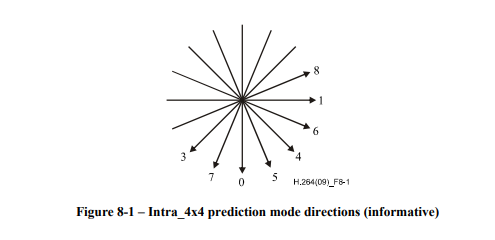

Рисунок 1 – intra углы [18]

![The nine intra prediction modes of the H264 standard [24], increased in...  | Download Scientific Diagram]()

Рисунок 2 – intra предсказание [19]

Касательно Inter предсказания – в H.264 этот способ работает так: существуют фреймы, являющиеся по сути кадрами видео. Фреймы делятся на несколько категорий, наиболее часто встречающимися являются *I*, *P*, *B* фреймы. *I*-фреймы независимо закодированы только intra методом, *P*-фреймы закодированы как разность motion-векторов (см. раздел 1.7.3) с предыдущим кадром, *B*-фреймы закодированы как разность motion-векторов с предыдущим и следующим кадром. AV1 не отделяет *I*-фреймы от *B*, *P*-фреймов, кодируя отдельный фрейм обоими способами, использует сильно более сложные методы предсказания и имеет новый вид фреймов – golden frame. Этот фрейм содержит в себе изображение высокого качества и часто используется для реконструкции. Также в AV1 вводится понятие суперфреймов, содержащих в себе несколько других фреймов, а один кадр может ссылаться не на 1-2 фрейма как в H.264, а иметь древовидную и комплексную структуру ссылок до 8 кадров, где каждому кадру соответствует временной слой (см. рис. 3, 4).

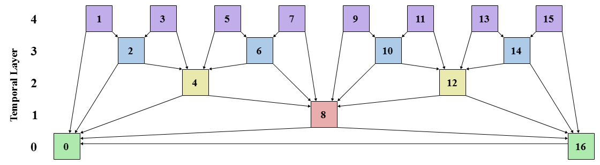

Рисунок 3 – мультиреференсные кадры в intra-предсказании [11]

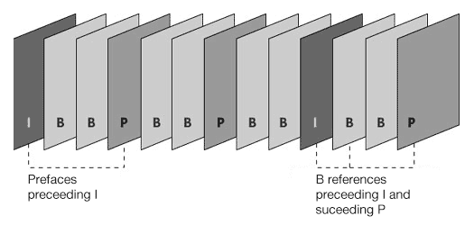

Рисунок 4 – референсная система в H.264 [16]

### Intra декодирование

Как уже было сказано, предсказания в кодеках делятся на 2 вида. В этой главе будут рассмотрены методы внутрикадрового предсказания.

* + 1. Макроблоки

В стандарте ITU-T H.264 макроблоками называются массивы luma пикселей 16\*16 и соответствующие им массивы Cb, Cr пикселей. Luma в данном случае означает яркость, Cb и Cr – цветовые компоненты синего и красного оттенков в формате YCbCr (Chroma-Luma). Макроблок – объект, которым оперирует inter или intra предсказание, а также множественные методы реконструирования и энтропийного декодирования.

В стандарте AV1-v1.0.0errata макроблоки заменяются суперблоками, однако общие принципы остаются теми же за исключением того что размерность суперблоков – 64\*64.

* + 1. Интерполяция

Интерполяция по своей сути в AV1-v1.0.0errata похожа на ту, что была в ITU-T H.264.

При расчете смещения пикселей с вычислением motion vectors может оказаться так, что смещение будет не на натуральное число пикселей, а на вещественное, и в этом случае результирующий пиксель рассчитывается как взвешенная сумма окружающих его пикселей. На рис. 5 представлен фрагмент из стандарта ITU-T H.264, поясняющий как именно вычислять интерполированный пиксель. Так, например, для пикселя в позиции b результирующее значение будет вычислено по формуле 1, а результирующее значение h – по формуле 2.

(E – 5\*F + 20\*G + 20\*H - 5\*I + J)/32 (1)

Где E, F, G, H, I, J – значения соответствующих пикселей, представленных на рис. 5

(A − 5 \* C + 20 \* G + 20 \* M − 5 \* R + T)/32. (2)

Где A, C, G, M, R, T – значения соответствующих пикселей, представленных на рис.5

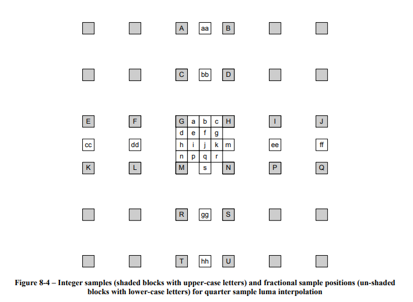

Рисунок 5 – пояснение к методу вычисления интерполяции [17]

Данное вычисление крайне тяжелое и массово, даже при максимальных оптимизациях с сохранением логики будет потреблять огромное количество процессорных тактов ввиду того, что даже для вычисления интерполяции всего лишь в одной плоскости понадобится минимум **22 такта** на x86 процессоре (не считая simd оптимизаций) [27]. Кроме 6-tap фильтра, описанного выше, существует обычная билинейная интерполяция и выбор первого или второго зависит от закодированной точности пикселя.

В стандарте AV1 интерполяция реализована похоже, однако коэффициенты (-1, 5, 10) динамические и закодированы в видео, притом всего вариантов коэффициентов 96 – по 16 на каждый метод интерполяции. В их числе обычная интерполяция, резкая, плавная и пр. Также в AV1 выше точность интерполяции и помимо 6-tap и билинейной интерполяции существуют 4-tap и 8-tap фильтры. Данная реализация на порядок «дороже» реализации H.264.

Данный тезис подтверждается статьёй [3], показывая связь интерполяции с остальными операциями. В статье говорится о том, что по сравнению с прямым предшественником AV1, VP9, её точность изменилась с 1/8 до 1/64. Это означает, что для расчёта одного пикселя с помощью 8-tap фильтра необходимо загрузить из памяти 8 пикселей и 8 коэффициентов, всего различных наборов коэффициентов – 96. Недостаток статьи в том, что она сосредоточена на кодировании, а не декодировании видео.

* + 1. Энтропийное кодирование

В декодерах-наследниках MPEG (к коим относятся рассматриваемые AV1 и H.264) также присутствуют методы сжатия путем энтропийного кодирования вроде DCT, ADST, FLIPADST, IDTX. Не вдаваясь в детали, это методы кодирования, при котором видеодекодер берет из потока байтов 2 коэффициента которые являются натуральными числами от 0 до 7, а затем переводит их в частоты через функцию косинуса (для discrete cosine transform). Так, например, из коэффициентов (0,0) будет восстановлена однородно-серая текстура, из (1,0) – горизонтальный градиент, из (7,7) – мелкую сетку. Это позволяет сильно сэкономить занимаемое место и время декодирования, так как методы декодирования сильно оптимизированы даже в виде нативного кода на си.

* + 1. CDEF

В AV1 существует такая технология как constrained directional enhancement filter (CDEF). CDEF представляет собой фильтр пост-обработки, который наряду с deblocking filter (DF) улучшает качество изображения. Выше были рассмотрены методы энтропийного кодирования, однако у них есть неприятное побочное действие: накопление ошибок на краях блоков. Восстановленная таким образом картинка похожа на мозаику из квадратов, как на рис. 6.

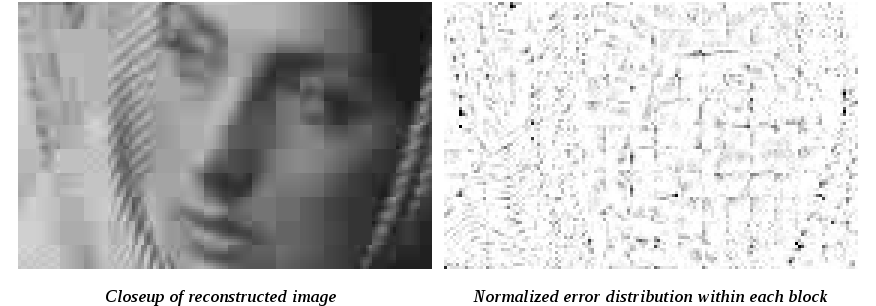

Рисунок 6 – ошибки инверсной дискретной реконструкции

Для решения этой проблемы существуют 3 фильтра, применяемых в каждом кадре по порядку: loop filter, CDEF. Конкретно CDEF отвечает за то, чтобы убрать шум рядом с границами. Для этого вычисляется, насколько текущий блок пикселей попадает в каждый из 8 фильтров направлений (45**°, 22.5°, 0°, -22.5°, -45°, -67.5°, -90°, -112.5°**) и дальше по границам идет фильтр, похожий на интерполяционный. В статье [3] предоставлена формула (7) фильтра по которой возможно оценить потенциальную трудоёмкость операции.

$y\left(i,j\right)=R(x\left(i,j\right)+g(\sum\_{m,n\in N}^{}w\_{m,n}f(x\left(m,n\right)-x\left(i,j\right), S,D)))$ (7)

Где N содержит пиксели соседние с x(i,j) с не-нулевыми весами $w\_{m,n}$,

f() и g() – нелинейные функции,

R(x) – округление x к ближайшему целому.

* + 1. Deblocking filter

Наряду с CDEF, DF устраняет блочность изображения, также за счет сложной интерполяции. Например, в работе [20] показана оптимизация адаптивного фильтра деблокинга, который работает на границах блоков 4x4. Его вычислительная сложность, несмотря на относительную простоту операций (сдвиги, сложения), остается высокой из-за необходимости обработки каждого пикселя на границе. В отличие от H.264, кодек AV1 использует более сложный и многоступенчатый подход к фильтрации, описанный подробно в главе VII статьи [21], что делает прямую репликацию методов невозможной. Однако, ключевая идея оптимизации — использование контекстной информации из битового потока для адаптации вычислительной нагрузки — остается актуальной для данной работы. Тем не менее, работа несет риск плохой воспроизводимости ввиду того, что используемые методы были применены на референсном декодере JM9.5, отличающемся тем, что в нём реализован необходимый минимум из стандарта. Это значит, что в нём изначально был большой потенциал оптимизаций и применение данной методики к AV1 может не дать существенного результата. Важно отметить, что DF и CDEF – дорогие операции для улучшения качества изображения в высоком разрешении.

### Inter декодирование

1. Motion Vectors

Motion vectors (MV) – один из важнейших способов сжатия в видеодекодерах, позволяющий не хранить все кадры. В видео почти всегда присутствует движение, и ввиду этого вместо того чтобы кодировать каждый кадр как изображение, возможно закодировать движение пикселей или областей пикселей. Например, есть видео в котором мяч летит в ворота, а камера неподвижна. Вместо того, чтобы отдельно кодировать каждый кадр кодируется начальный кадр, а дальше – только дельты пикселей мяча для каждого кадра. Опорные кадры (также называющиеся reference frames или IDR frames) – кадры, которые невыгодно кодировать с помощью motion vectors, например смена сцены или положения камеры.

1. Frames

Подробная информация о фреймах представлена в разделе 1.7, можно лишь добавить что в AV1 существуют hidden frames – опорные фреймы, которые не добавляются в итоговый результат.

### Результаты анализа стандарта AV1

После проведенного анализа возможно выделить следующие средства, на которые стоит обратить внимание при оптимизации, представленные в таблице 2.

Таблица 2 – сравнительная характеристика ключевых процессов AV1

|  |  |
| --- | --- |
| таблица | Почему должно быть оптимизировано |
| CDEF | Тяжеловесная формула (7), результат не виден в низком разрешении |
| DF | Применяется к каждому блоку, результат не виден в низком разрешении |
| Интерполяция | Применяется к каждому пикселю, занимает минимум 71 такт на пиксель |
| Энтропийное кодирование | Имеет смысл оптимизация для низкого разрешения с квантизацией коэффициентов |

Данные операции занимают много ресурсов и должны быть оптимизированы в первую очередь. В перспективе это даст хорошее увеличение производительности. В главе «реализация» приведено профилирование данных частей стандарта.

* 1. Анализ методов оптимизации кода

В данной главе будет рассказано об основных методах оптимизации с опорой на «правила оптимизации», предложенные профессором Массачусетского Технологического Института Джоном Луисом Бентли. В главе «Реализация» они будут применены для сокращения времени декодирования видео.

### Правила Бентли

Правила Бентли представляют собой подобие чек-листа из 20 пунктов, разделённых на 4 раздела: структуры данных, логика, циклы и функции. Некоторые пункты потеряли актуальность в связи с тем, что GNU GCC компилятор применяет их при включенных флагах -O2, -O3, а некоторые неприменимы к данной задаче. Рассмотрим оставшиеся.

1. Инициализация во время компиляции

Данный метод представляет собой практику инициализации значений во время компиляции. Например, есть функция, вычисляющая синус, умноженный на косинус, а точность выходного значения не сильно важна. В этом случае возможно инициализировать массив вида

uint32\_t cossin[10]={0.0, 0.476, 0.294, -0.294, -0.476, -0.0, 0.476, 0.294, -0.294, -0.476} (3)

затем вычислять приблизительное значение как

result = cossin[i] (4)

где i – (π\*2/10)\*(требуемый угол)

Вычисляемые значения будут с погрешностью входного значения < π\*1/5. Тем не менее, данная методика может понижать производительность. В статье [22] рассматривается энтропийный декодер CAVLC кодека H.264, который, как и AV1, VP9, HEVC(H.265) является наследником MPEG и берет некоторые его концепции, а следовательно некоторые идеи по оптимизации H.264 могут быть полезны и для AV1. В частности, в статье рассматриваются такие методы оптимизации как аппаратное ускорение и отказ от lookup tables, пример которой представлен в данном разделе. Второй раздел более полезен для данной работы. В нём рассказывается о том, что отказ от множества lookup tables в пользу алгебраического выражения быстрее, так как это избавляет от необходимости в множественных вычислениях и кеш-промахах при обращении к данным.

1. Плотность

Как будет рассмотрено в разделе 1.9.2, крайне важно оптимизировать код для процессорного кеша, ввиду этого необходимо соблюдать плотность данных. Например, представим что в примере выше массив был инициализирован с точностью входного значения менее PI\*1/500, тогда в массиве будет 1000 значений. Если код будет запрашивать элементы в соответствии с нормальным распределением и если учесть что линия процессорного кеша вмещает 8 его элементов, то процент промахов может достигнуть 87.5%. Если же элементов 10, то при прочих равных процент промахов не будет выше 20%.

1. Объединение тестов

Общеизвестно что процессор имеет механизм branching. Это значит, что процессор может предсказать результат логического ветвления в коде и в соответствии с ним «положить» в конвейер инструкций соответствующий участок кода. Чем меньше процент верно угаданных развилок, тем ниже производительность, и соответственно выгоднее всего сократить количество возможных развилок объединив несколько условий в одно.

1. Упорядочивание проверок

В языках программирования логические операторы, как правило, «ленивые», следовательно необходимо упорядочивать проверки в условиях так, чтобы конечный результат был известен как можно раньше.

5. Логические преобразования

Данный метод не входит в перечень оптимизаций Бентли, однако его можно отнести к подвиду объединения тестов. Суть логических преобразований в том, чтобы заменить обычные логические вычисления быстрыми битовыми вычислениями.

Например, условие

if (x<4096 && x>=256) (5)

можно заменить условием

if( (x|~0xFF)&&(!(x&~0xFFF)) ). (6)

Данный подход рассмотрен в статье [23]. В ней рассматриваются метод деления при помощи «магической константы» и его оптимизированный вариант, работающий на 30% быстрее. Деление редко встречается в декодировании видео и больше присутствует в кодировании, однако этот метод, несмотря на его сложность, может помочь ускорить интерполяцию, так как она производится путем деления суммы произведений коэффициентов фильтра и значений пикселя.

### 1.8.2. Оптимизация CPU-кеша

CPU-кеш – один из главных методов оптимизации кода. Его правильное использование может уменьшить скорость выполнения кода на величину до 99% в синтетических задачах. На рисунке 7 представлена относительная скорость доступа к разным типам памяти, и из него понятно, что доступ к ячейке оперативной памяти DDR4 в 120 раз более долгий чем доступ к ячейке L1 процессорного кеша. Следовательно, максимальная выгода в синтетической задаче от перемещения данных из dram в L1 кеш более 99%.

Разумеется, это верно только для нескольких килобайт данных (48кб для intel i5-12400f), так что необходимо особо тщательно подходить к порядку запроса данных и количеству запрошенных данных.

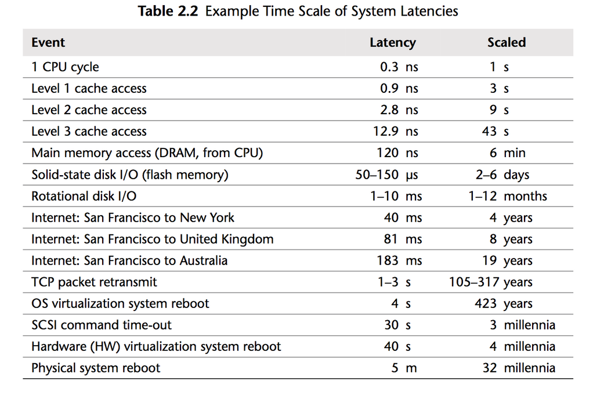

Рисунок 7 – memory latency table [24]

* 1. Анализ существующей инфраструктуры

В силу действующего контракта между «ООО КОМЭКСП» и исполнителем данной работы будет рассмотрена только структура существующей базы данных.

На рисунке 8 представлена ER-диаграмма существующей базы данных. Из нее видно, что каждый архив связан с пользователем, а каждое видео — с архивом. На данный момент система позволяет объединять несколько видео в одну бизнес-сущность — архив.

Подробное описание предназначений полей предоставлено в таблице 3.

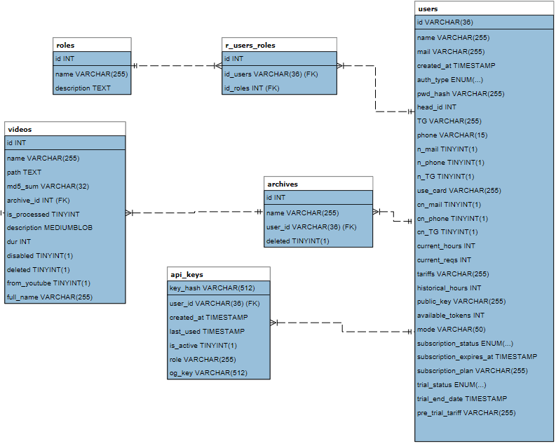

Рисунок 8 – ERD базы данных

Таблица 3 – пояснение к ERD

|  |  |  |  |
| --- | --- | --- | --- |
| таблица | Поле | Тип данных | Для чего нужно |
| Любая таблица | Id | int | Идентификатор записи |
| users | Name | String | Имя пользователя |
| Mail | String | Почта пользователя |
| Created\_at | Timestamp | Когда был создан аккаунт |
| Auth\_type | String | Тип аутентификации |
| Pwd\_hash | String | Хэш пароля |
| TG | string | Идентификатор в Телеграм |
| Phone | String | Номер телефона |
| Current\_hours | Int | Количество часов, в течение которых пользователь может использовать TAPe |
| Tariffs | String | Тариф пользователя |
| Public\_key | String | Публичный ключ пользователя |
| Available\_tokens | Int | Доступное количество токенов для поиска |
| Subscription\_status | string | Статус подписки |
| Subscription\_expires\_at | Timestamp | Когда кончается подписка |
| Subscription\_plan | String | План подписки |
| Trial\_status | String | Статус пробного периода |
| Trial\_end\_date | Timestamp | Конец пробного периода |
| Pre\_trial\_tariff | String | Какой тариф был перед пробным периодом |
| archives | Name | String | Название архива |
| User\_id | Int | Идентификатор владельца архива |
| Deleted | Bool | Удален ли архив |
| Api\_keys | Key\_hash | String | Хэш апи ключа |
| User\_id | Int | Идентификатор пользователя ключа |
| Created\_at | Timestamp | Когда был создан ключ |
| Last\_used | Timestamp | Последнее использование ключа |
| Is\_active | Bool | Активен ли ключ |
| Role | String | Роль ключа (администратор, владелец, пользователь) |
| videos | Name | String | Название видео |
| Path | String | Путь, по которому расположено видео |
| Md5\_sum | string | Md5 сумма видеофайла |
| Archive\_id | Int | Ид архива, которому принадлежит видео |
| Is\_processed | Bool | Проиндексировано ли видео |
| Description | String | Описание видео |
| Dur | Int | Длительность видео в секундах |
| disabled | Bool | Отключено ли видео |
| Deleted | Bool | Удалено ли видео |
| From\_youtube | Bool | Скачано ли видео с Youtube |
| Full\_name | String | Полное название видео |

* 1. Анализ технологического стека

Для того, чтобы построить быструю и правильно работающую систему, которую легко поддерживать необходимо выбрать подходящие технологии. В данной главе будут перечислены основные технологии необходимые для реализации проекта.

* + 1. Веб-сервер

В качестве веб-сервера был выбран фреймворк **FastApi**. Несмотря на то, что он написан на Python и в связи с этим имеет проблемы с Requests Per Second, он является одним из самых быстрых веб-фреймворков для Python [15] ввиду минимального оверхеда, в отличие например от Django с большим количеством слоев абстракций и синхронной блокирующей архитектурой.

* + 1. Оркестрация

Учитывая требование о масштабируемости системы, она будет расположена на нескольких серверах для того чтобы обеспечить линейную загруженность пропорционально запросам. В связи с этим необходимо оркестрировать серверы, и для этого лучше всего подходит **Docker swarm** ввиду легкости развертывания. В дальнейшем может быть произведена миграция на Kubernetes.

* + 1. Базы данных

Немаловажным фактором в задержках является также база данных. Для хранения «горячих данных» вроде токенов (Api\_keys) пользователя будет использован **Redis**, так как он, храня информацию в оперативной памяти, уменьшает задержки памяти с уровня ssd/hdd до уровня оперативной памяти, что, исходя из таблицы на рис.7, может снизить задержку доступа к данным на 1-2 порядка.

Для некритичных данных (Videos, Users, Archives) используем **PostgreSQL** ввиду её субъективного удобства и хорошего потенциала к масштабируемости, а для файлов используем S3 хранилище **Ceph**.

Следует пояснить, почему выбрано именно S3 хранилище для файлов вместо обычной файловой системы. Даже если бы в работе была не распределенная архитектура с одним сервером-монолитом, это было бы ненадежно и нестабильно. Файловая система ext4, являющаяся системой по умолчанию, не справляется с большим количеством (больше миллиона) директорий и файлов, что было выявлено в «ООО КОМЭКСП» экспериментально. К тому же, обращение к файлам по их путям в коде достаточно неудобно. В свою очередь, Ceph имеет в себе оптимизации для хранения множества мелких файлов.

* + 1. Брокер сообщений

Учитывая распределённую архитектуру системы понадобится также брокер сообщений. Большинство брокеров используют под капотом быстрый протокол NATS, являющийся надстройкой над QUIC, так что будет выбран брокер с минимальным оверхедом – **NATS Jetstream**. Он характеризуется минимальными задержками, выдавая 1-5мс с гарантией доставки против 10-50мс у kafka [7].

* + 1. Фронтенд

В качестве фреймворка для фронтенда выберем **React,** так как он фактически на данный момент является монополистом рынка среди других фреймворков [8] и предлагает интеграцию с WASM. Для ускорения передачи видео будет использоваться **ffmpeg**, скомпилированный в **WebAssembly** для отделения аудио от видео.

* 1. Результаты анализа объекта автоматизации

В ходе работы была проанализирована предметная область, представляющая собой способы кодирования видео, основные методы оптимизации и краткий разбор технологий, которые будут использоваться. Также были перечислены потенциальные узкие места в стандарте видеокодека AV1 и основные методы оптимизации согласно профессору Массачусетского Технологического Института Джону Луису Бентли.

Данная информация в будущем поможет при проектировании и реализации системы для декодирования видео.

В результате анализа предметной области было составлено техническое задание, представленное в приложении Д.

# Проектирование

В данной главе будет представлено проектирование системы для декодирования видео в формате AV1. Несмотря на то, что система предназначена только для одной функции, необходимо будет реализовать вокруг неё полноценную инфраструктуру, включающую в себя базу данных, брокер сообщений, фронтенд и бэкенд.

Для последующего анализа эффективности оптимизация также будет спроектирована наивная реализация системы, без каких-либо оптимизаций. Анализ производительности будет производиться по следующим параметрам:

* + - Общая задержка от начала отправки видео на сервер до полного декодирования видео, в секундах.
    - Минимальное время декодирования видео без учета времени передачи видео по результатам пяти тестовых запусков.
    - Покадровая метрика потери качества видео, вычисляемая как разница Luma значений каждого пикселя кадра видео.
    - Покадровая метрика PSNR.
    - Время ответа при нагрузочном тестировании системы.

Целевыми метриками считаются ускорение метрик 1 и 2 на 30-50% и 20-35% соответственно в сравнении с наивной реализацией, при этом PSNR должно сохраняться выше 15дб. Метрики 3 и 5 необходимы для характеризации системы в целом, но не критичны.

### Проектирование наивной реализации системы

Наивная реализация системы будет спроектирована максимально просто. Она будет представлять собой простое Flask-приложение, также включающее в себя frontend как jinja templates. На рис. 9 представлена диаграмма контейнеров наивной системы. Как можно увидеть, центральным является контейнер с flask приложением, включающий в себя весь функционал. Рассмотрим данный контейнер детальнее на рис. 10.

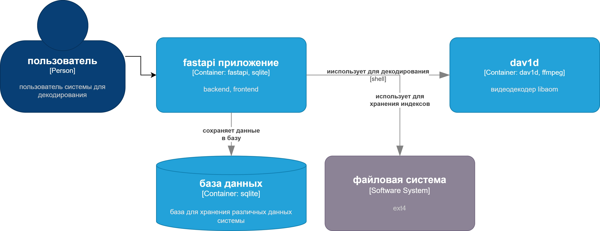

Рисунок 9 – naive system container diagram

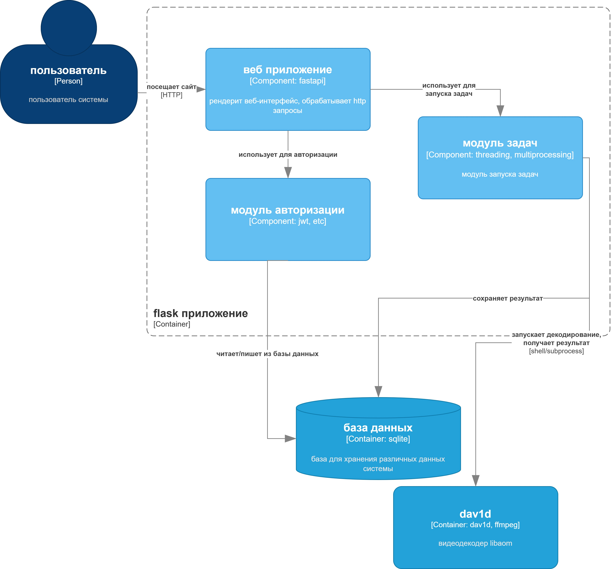

Рисунок 10 – диаграмма контейнера flask приложения

На данной диаграмме показано, как контейнер будет выглядеть внутри. Он будет использовать обыкновенную jwt-систему для авторизации, токены при этом будут храниться в sqlite. Планирование задач декодирования будет выполнено с помощью встроенных в python3 средств, таких как threading и multiprocessing.

### Проектирование базы данных

Учитывая, что наивная реализация необходима только для сравнения с оптимизированной реализацией, оставим только необходимые поля таблиц. В результате получим следующую ER диаграмму, представленную на рисунке 11. В данной схеме есть 4 таблицы.

Таблица Users предназначена для хранения информации о пользователях, идентификация производится по номеру телефона и паролю, притом пароль не хранится в открытом виде.

Таблица archives является бизнес-сущностью, объединяющей несколько видео. У архива есть название и идентификатор, притом архив может принадлежать одному пользователю.

Таблица Videos хранит метаданные о видео, включая его путь в файловой системе на сервере, md5 сумму и состояние, в котором оно находится.

Таблица Api\_keys хранит в себе токены для авторизации пользователя.

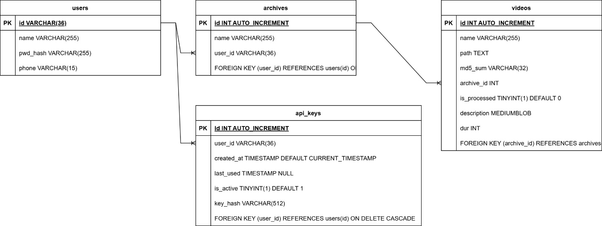

Рисунок 11 – ER диаграмма базы данных наивной реализации

### Проектирование оптимизированной реализации системы

Наивная архитектура, рассмотренная выше, представляет собой неоптимизированную монолитную систему, которую крайне сложно масштабировать. В данной главе будет рассмотрена реализация максимально быстрой и надежной версии системы.

Прежде всего необходимо будет сократить IO издержки, связанные с передачей файлов по сети. Учитывая, что система необходима для поиска видео по видео, объем файлов в некоторых случаях может достигать двух гигабайт. Для декодирования видео не нужна звуковая дорожка, присутствующая почти в каждом видеофайле, что поможет в оптимизации передачи видео. В связи с этим понадобится на стороне клиента вырезать из видеофайла аудиодорожку и отправлять в бэкенд получившийся файл. Также будет использован React как фреймворк для фронтенда ввиду его популярности и что более важно, масштабируемости.

Как было показано на рис. 7, длительность обращения к оперативной памяти может быть сильно быстрее обращения к памяти на жестком диск, это означает, что если видео будет сохранено в файловую систему и будет декодировано оттуда, то это будет медленнее чем декодирование из оперативной памяти. Для минимизации данной задержки используем принцип memory buffer, то есть декодирование из оперативной памяти напрямую. Данный подход работает не всегда, особенно при высоких нагрузках, и в этом случае всё-таки понадобится сохранить файл. Учитывая распределённую архитектуру, используем S3 хранилище. Оно необходимо, учитывая, что нужно будет распределить хранилище по нескольким серверам, что решит проблему ограниченности памяти.

Backend же тоже будет распределён по нескольким серверам. Для того, чтобы обеспечить согласованность серверов и доставку сообщений будет использован брокер сообщений NATS Jetstream. На таблице 4 продемонстрировано сравнение популярных брокеров сообщений. Стоит отметить, что очередь необходима также для асинхронных коммуникаций, а потому необходима персистентность сообщений. Стоит отметить, что NATS Jetstream – не идеальный брокер, который, в отличие от Apache Kafka, появился сравнительно недавно и поэтому у некоторых пользователей Jetstream появляются проблемы со стабильностью. Тем не менее, это один из самых быстрых брокеров, что имеет первостепенное значение для решаемой задачи.

Таблица 4 – сравнительный анализ брокеров сообщений

|  |  |  |  |
| --- | --- | --- | --- |
| Брокер сообщений | Латентность | Сравнительная пропускная способность | Персистентность |
| Core NATS | <1мс [13] | Высокая | Нет |
| NATS JetStream | 1-5мс [12] | Выше среднего | Да |
| Apache Kafka | 10-50мс [12] | Высокая | Да |
| RabbitMQ | 5-20мс [14] | Средняя | Да |

Система представлена в виде диаграммы C4 на рис. 12.

|  |  |
| --- | --- |
| 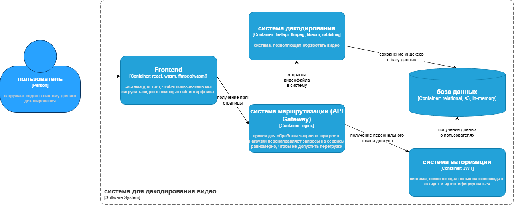 | Рис. 12 – диаграмма контейнеров системы. |

Диаграмма компонентов представлена на рис. 13. Рассмотрим самые важные из них в следующих главах.

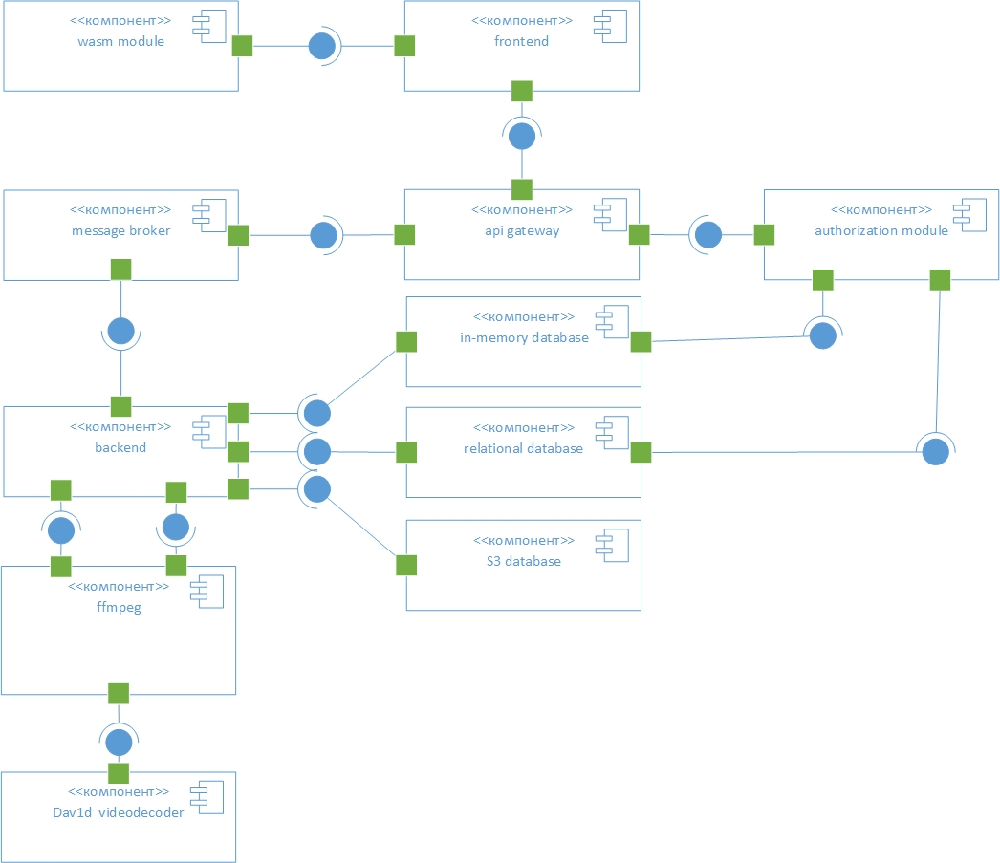

Рисунок 13 – диаграмма компонентов оптимизированной системы

### Проектирование реляционной базы данных

Для данной системы будут использоваться несколько различных баз: low-latency база для горячих данных, реляционная база для стандартных реляционных данных и S3 хранилище Ceph для видеофайлов и индексов.

Опустим проектирование нереляционных баз ввиду того, что их структура легче поддаётся изменению.

В качестве реляционной базы будет использован PostgreSQL ввиду его масштабируемости и интеграции, а также большей устойчивостью к высоким нагрузкам чем у его прямого конкурента MySQL.

Структура таблиц будет перенесена из существующей базы, ER диаграмма которой представлена на рис. 8, так что она будет оставлена без изменений. Имеет смысл рассмотреть предназначение таблиц в существующей базе данных.

Таблица Users, как и в наивной реализации, хранит данные о пользователях, но в гораздо большем объеме, включая метод авторизации, дату регистрации, тарифный план и т.д.

Таблица Roles и соответствующая ей таблица r\_users\_roles позволяют установить соответствие конкретного пользователя/пользователей к роли/ролям, будь то администратор или обычный пользователь.

Таблицы Videos и Api\_keys хранят информацию, аналогичную тем же таблицам в наивной реализации.

### Проектирование бэкенда

Бэкенд системы является центральным компонентом всей архитектуры и отвечает за обработку пользовательских запросов, управление задачами декодирования, взаимодействие с базами данных и интеграцию с видеодекодером. Основной задачей серверной части является обеспечение максимально быстрой обработки операций «загрузка – декодирование» при сохранении масштабируемости системы. Для этого был выбран подход горизонтального масштабирования, при котором увеличение вычислительных мощностей достигается за счет увеличения серверов. Компонент Api Gateway проксирует запросы на свободный сервер-реплику с компонентами бэкенда и декодера, а если такового нет, то на наименее занятый сервер. Степень загрузки мониторится из бэкенда и сохраняется в redis.

Для того, чтобы обработать все запросы, будет применен паттерн «request queue», реализация которого в архитектуре системы представлена на рис. 14. Смысл данного паттерна в том, чтобы сохранять запросы в очередь и равномерно маршрутизировать их на реплики бэкенда, что гарантирует обработку всех запросов.

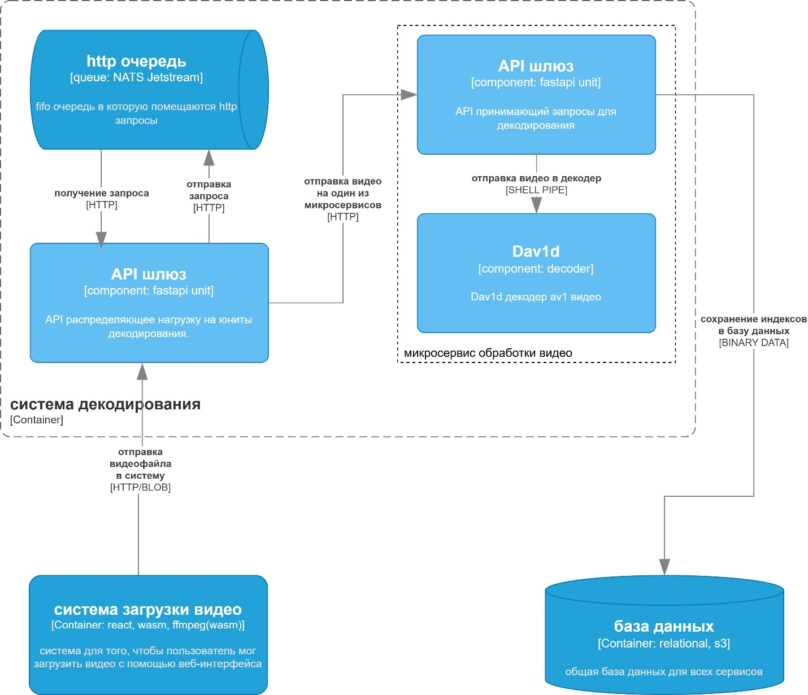

Рис. 14 – Схема системы декодирования

Как видно из рис. 13, бэкенд связан с компонентами message broker, api gateway и ffmpeg. FFMPEG является инструментом с открытым кодом для работы с видео. В нём реализованы методы работы с файловой системой и видеодекодерами, поэтому и в наивной, и в оптимизированной реализации он будет необходим для использования Dav1d. Коммуникация с FFMPEG будет происходить через shell, с использованием in-memory файловой системы или S3 хранилища когда это невозможно. На рис. 15 представлена упрощенная реализация decision tree маршрутизатора. Наиболее приоритетный сервер для декодирования – сервер со свободной оперативной памятью и вычислительными мощностями. В случае, если не хватает оперативной памяти, будет использован метод потокового декодирования из S3 хранилища. На данный при определении доступной вычислительной мощности для декодирования исходим из того, что количество доступных ядер = (суммарное количество логических ядер процессора – 1), так как одно из ядер должно оставаться за wsgi сервером В случае превышения этого количества ожидается снижение производительности за счет вытеснения одного процесса другим. В главе «реализация» будет экспериментально проверено оптимальное количество ядер.

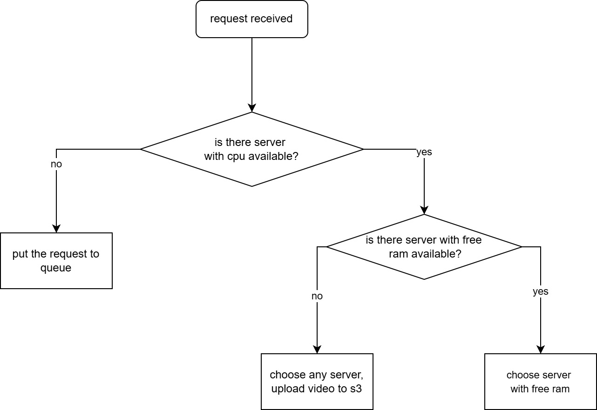

Рис. 15 – Алгоритм метода выбора сервера для декодирования

Как было рассмотрено в главе 2.2.1, каждому видео соответствует статус обработки. Это целое значение, которое имеет несколько состояний: uploaded, queued, processing, done, failed, retrying. Их возможная смена показана на рис. 21.

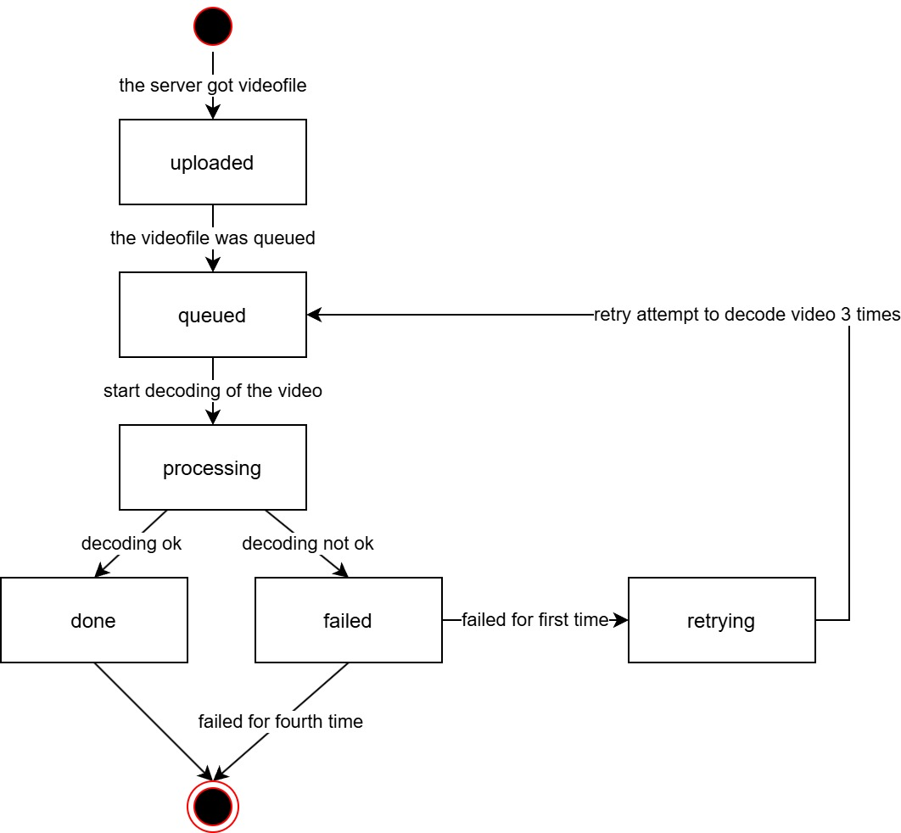

Рис. 21 – диаграмма состояний видео

В таблице 5 показаны требуемые REST эндпоинты, которые будут реализованы в апи.

Таблица 5 – требуемые эндпоинты

|  |  |  |  |  |  |
| --- | --- | --- | --- | --- | --- |
| Метод | Путь | Описание | Тело запроса | Ответ | Код |
| POST | /auth/register | Регистрация пользователя | Phone, password | user\_id | 201 |
| POST | /auth/login | Авторизация | Phone, password | access\_token, refresh\_token | 200 |
| POST | /auth/refresh | Обновление токена | Refresh\_token | access\_token | 204 |
| POST | /auth/logout | Выход | - |  | 200 |
| POST | /archives | Создать архив | Name | archive\_id | 200 |
| GET | /archives | Список архивов пользователя |  | [{archive\_id, name, created\_at}] | 200 |
| POST | /archives/{archive\_id}/videos | Загрузить видео в архив | .obu файл | video\_id, task\_id | 202 |
| GET | /archives/{archive\_id}/videos | Список видео в архиве |  | [{video\_id, name, state}] | 200 |
| DELETE | /videos/{video\_id} | Удалить видео |  |  | 204 |

Выше было упомянуто, что задача имеет свой статус, однако в требуемых эндпоинтах нет опции узнать статус. Это сделано из-за того, что нотификация пользователя будет происходить с помощью соединения через вебсокет.

Уведомление через вебсокет – довольно удобное и логичное решение, избавляющее от необходимости посылать http запрос каждый несколько секунд чтобы узнать статус. Однако появляется новое ограничение, связанное с особенностью вебсокета: при большом количестве подключений система начинает работать медленнее. Чтобы избежать замедления воспользуемся мощностями серверов, проксируемых с помощью API Gateway. Каждое соединение вебсокета будет держаться на отдельном сервере до момента пока у пользователя есть активные задачи. Когда приходит уведомление о конце задачи в очередь происходит бродкаст-рассылка этого сообщения на все реплики, и реплика, выполняющая эту задачу, закрывает соединение. Это показано на рис. 22.

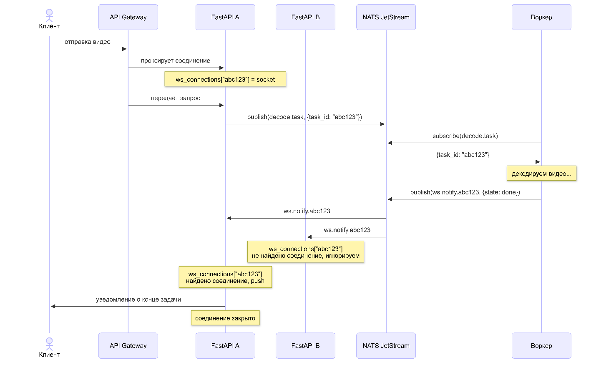

Рисунок 12 – диаграмма последовательности для уведомления клиента

### Проектирование фронтенда

Фронтенд системы выполняет несколько задач, включающих в себя авторизацию пользователя, загрузку видеофайлов, их предварительную обработку и отправку обработанных видео на сервер.

Для отделения аудиоданных от видео используется FFMPEG, скомпилированный под архитектуру WebAssembly. Компиляция осуществляется с помощью инструмента Emscripten, что позволит запустить код на C в браузере, на стороне клиента.

Дизайн не играет особой роли в данной системе (по крайней мере, не является основной целью), так что было принято решение спроектировать его максимально простым. Интерфейс состоит из трех экранов: регистрация, логин и загрузка видео. Их прототипы представлены на рис. 16, 17 и 18 соответственно.

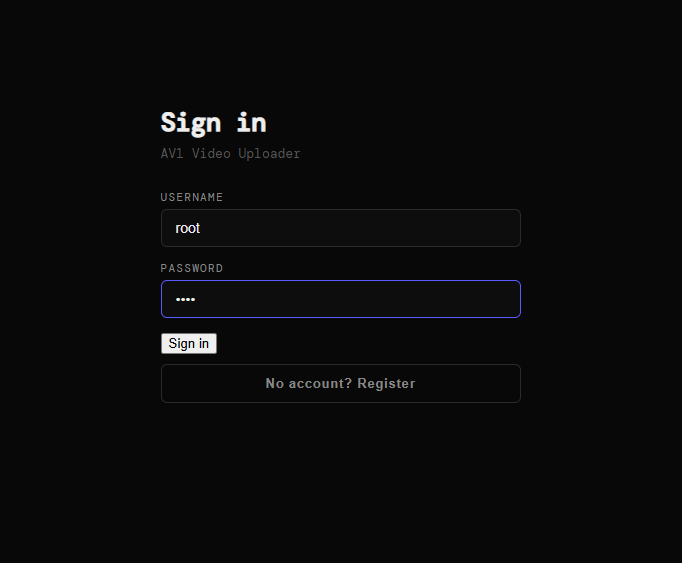

Рис. 16 – экран входа

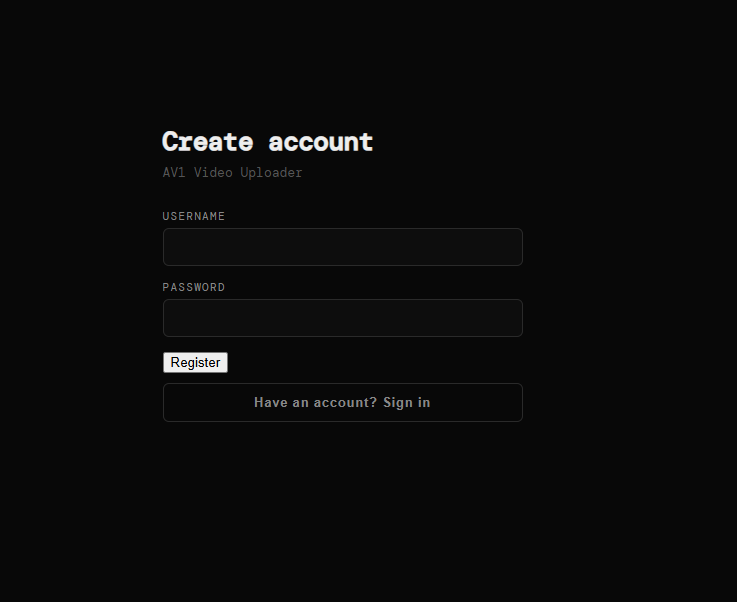

Рис. 17 – экран регистрации

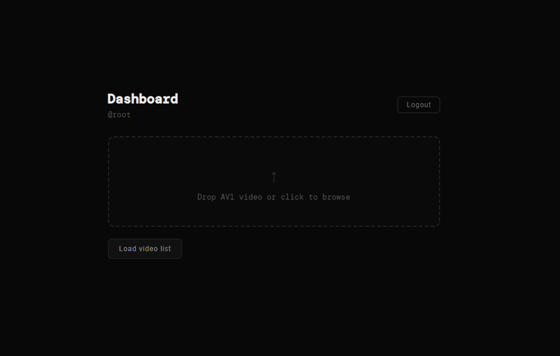

Рис. 18 – экран загрузки видео

### Проектирование оптимизаций Dav1d

В данной главе будут описаны основные методы оптимизации Dav1d, ранее затронутые в главе 1. Стоит оговориться, что видеодекодер – крайне оптимизированное по, и любое серьёзное вмешательство может вызвать в нём эффект домино, сбивая общую структуру, оптимизированную под процессорный кеш, архитектуру процессора и пр. В связи с этим в данной главе не будут предлагаться радикальные вмешательства, меняющие общую структуру данных или логику работы кодера.

CDEF

Constrained directional enhancement filter, как было рассмотрено в разделе 1.7.2, является ресурсоемкой но важной частью для сохранения качества видео при декодировании. Тем не менее, в задаче декодирования в сверхнизком разрешении артефакты на границах блоков, как правило, не влияют на качество видео, так что будут проведены два эксперимента: с четырьмя фильтрами с углами наклона (45**°, 0°, -45°, -90°**) вместо восьми исходных (45**°, 22.5°, 0°, -22.5°, -45°, -67.5°, -90°, -112.5°**) и с отключённым CDEF.

DF

В отличие от CDEF, DF имеет также высокое значение для низкого разрешения. Это значит, что если отключить фильтр блочности сразу на всех кадрах, то артефакты будут накапливаться от опорных кадров с каждым новым B-кадром. Для устранения этого эффекта будет использоваться подход, при котором фильтр блочности будет применяться только для опорных кадров, хоть стандарт errata и подразумевает что DF должен быть включен либо выключен везде. В таком случае накопление артефактов должно замедлиться, учитывая, что каждый кадр использует сразу несколько опорных кадров. Также будет реализована версия, в которой DF вырезан полностью, чтобы подтвердить или опровергнуть вышеупомянутую гипотезу.

Entropy coding

Теоретически энтропийное декодирование занимает меньше ресурсов, чем интерполяция или фильтры. Тем не менее, оно происходит на каждом кадре в минимум одном блоке, так что имеет смысл попробовать его оптимизировать.

Как упоминалось в главе анализа, DCT и IDCT использует таблицу частот, также называемую таблицей квантизации. В качестве оптимизации можно применить подход обрезки, квантовав её в 4 раза, оставив только частоты в верхнем левом квадрате. На рис. 19 красным цветом обозначены частоты, которые будут оставлены, а синим – все доступные частоты при операции IDCT. Если гипотеза верна, то при такой оптимизации видео с низким разрешением почти не потеряет качество, так как высокие частоты используются для кодирования мелких деталей видео, которые не важны. В случае успеха оптимизация будет расширена до других методов энтропийного декодирования.

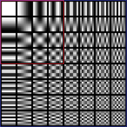

Рис. 19 – объяснение метода квантизации таблицы коэффициентов

Интерполяция

Для оптимизации интерполяции, как и для DF и CDEF будут использоваться 2 метода: полный вырез и максимальное облегчение. Для второго варианта нужно предусмотреть сохранение качества, потому что иначе может произойти каскадная деградация качества. На рис. 20 можно заметить, что в процессе интерполяции коэффициенты на 1,2,7 и 8 позициях очень редко имеют большое значение. Это значит, что возможно попробовать без ущерба для качества видео вырезать их и оставить 4-tap интерполяцию по коэффициентам 3-6, либо 2-tap, в зависимости от метрики PSNR по результату.

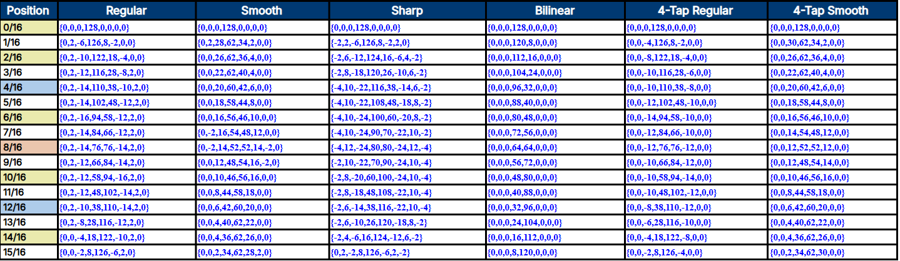

Рис. 20 – таблица коэффициентов интерполяции [11]

### Выводы

В ходе проектирования была разработана архитектура системы быстрого декодирования видео в формате AV1, удовлетворяющая функциональным и нефункциональным требованиям, сформулированным в главе 1.

Для обеспечения возможности сравнительного анализа была спроектирована наивная реализация системы на основе монолитного Flask-приложения с хранилищем SQLite. Данная реализация намеренно лишена каких-либо оптимизаций и служит базовой точкой отсчёта для измерения эффективности оптимизированной версии.

Оптимизированная реализация системы построена на принципах горизонтального масштабирования и минимизации задержек на каждом уровне стека. В качестве ключевых архитектурных решений были приняты следующие: использование брокера сообщений NATS JetStream для асинхронной маршрутизации задач декодирования между репликами бэкенда; применение Redis для хранения горячих данных о состоянии задач с целью снижения задержки доступа по сравнению с реляционной базой данных; декодирование видео из оперативной памяти в приоритетном порядке, с использованием S3-хранилища Ceph в качестве запасного варианта при недостатке памяти.

Спроектирован REST API, необходимый для авторизации, управления архивами и жизненного цикла задач декодирования. Для уведомления клиента о завершении декодирования выбран протокол WebSocket вместо HTTP-поллинга, что исключает избыточные запросы к серверу и снижает итоговую задержку уведомления с 0–2000 мс до уровня сетевой латентности.

Жизненный цикл задачи декодирования формализован в виде диаграммы состояний, включающей шесть состояний: uploaded, queued, processing, done, failed, retrying.

На стороне клиента спроектирован модуль предварительной обработки видео на базе ffmpeg, скомпилированного в WebAssembly, выполняющий отделение аудиодорожки перед отправкой файла на сервер. Данное решение позволяет сократить объём передаваемых данных без потери информации, необходимой для индексации.

Таким образом, спроектированная система обеспечивает выполнение всех требований, выявленных в ходе анализа предметной области, и формирует основу для последующей реализации и оптимизации декодера Dav1d, описанных в главе 3.

# Реализация

В данной главе совмещены написание финальной оптимизированной системы, оптимизации DAV1D и тестирование оптимизаций с указанием их влияния на итоговую производительность.

Глава делится на 4 раздела: «оптимизации DAV1D», «финальная система», «тестирование», «исходный код». В первом разделе описаны проведённые оптимизации DAV1D и их результаты. Во втором разделе описана реализация оптимизированной и наивной систем. В третьем разделе описаны протоколы тестирования каждой из частей и их результат. В четвёртом приведены ссылки на репозитории с работой.

* 1. Оптимизации DAV1D

Все оптимизации, приведённые ниже, протестированы с помощью утилиты Hyperfine и тестового отрывка фильма «Fast & furious 8» длиной в 30 минут, каждая оптимизация тестируется в 3 итерации с прогревом жесткого диска в одноядерном режиме, в качестве оценки используется минимальное время, так как оно является минимально зашумленной метрикой. Тесты запущены на сервере с ОС ubuntu 22.04.5, без графической оболочки и устройств пользовательского ввода, без других запущенных пользовательских процессов кроме родительского процесса бенчмарка и дочернего процесса декодирования.

Для каждой оптимизации также представлено визуальное сравнение с помощью утилиты FFMPEG.

Минимальное время, замеренное на стандартной имплементации DAV1D с отключенными SIMD, в однопоточном режиме: 545.83с.

### CDEF, Loop filter (DF)

Вопреки ожиданиям, отключение одновременно Constrained Directional Enhancement Filter и Deblocking Filter (называющийся в стандарте errata Loop Filter) снизило качество на незначительные значения, при этом существенно сократив время обработки видео на 26%, составив 404с со средним значением 415с. В связи с этим нет необходимости производить оптимизации данных частей. Тем не менее, представленные методы могут быть использованы при оптимизации видео для более высокого разрешения.

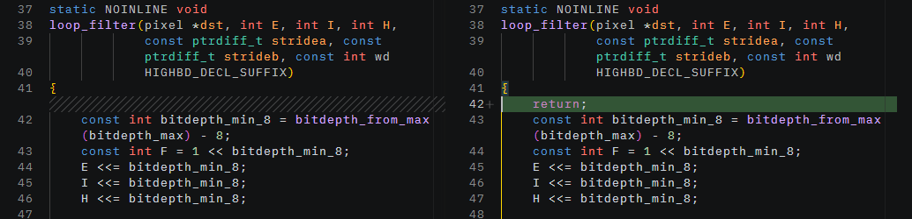

Рис. 21 – дельта файла loopfilter\_tmpl.c

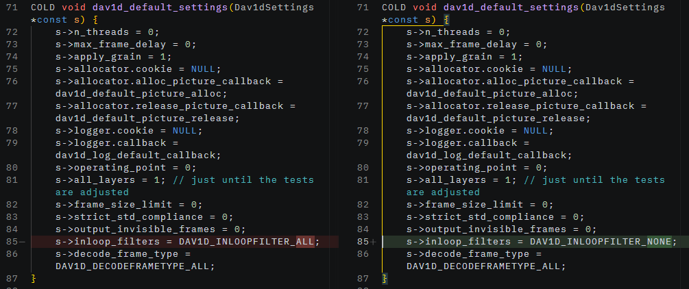

Рис. 22 – дельта файла lib.c

### Интерполяция

Для оптимизации одного из самых ресурсоемких процессов было использовано несколько методов, каждый из них приведён ниже.

* + 1. Сокращение количества фильтров до 6

В качестве первого метода оптимизации интерполяции был выбран метод сокращения фильтров интерполяции с восьми до шести, что сократило время декодирования на 30.5%, составив 379с со средним значением 393с. Данная оптимизация не затрагивает коэффициенты интерполяции, представленные на рис. 20, и сохраняет приемлемое качество видео ввиду того, что коэффициенты на позициях 1 и 8 (опущенные в данном варианте), как правило, имеют значение 0, то есть не влияют на итоговый результат.

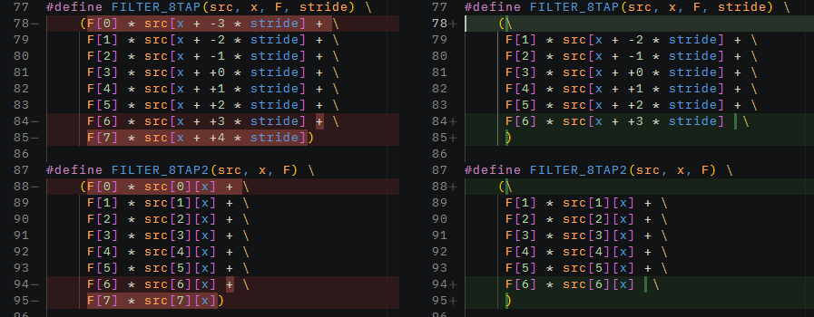

Рис. 23 – дельта файла mc\_tmpl.c

* + 1. Сокращение вариантов интерполяции до 6

В качестве второго метода оптимизации были сокращены варианты интерполяции с 90 до 6. Каждый из вариантов, представленный на рис. 20, имеет смещение к левому краю или правому, сохраняя баланс коэффициентов. Возьмём, к примеру, коэффициенты sharp 0/16 и 10/16, представляющие собой {0,0,0,128,0,0,0,0} и {-2,8,-20,60,100,-24,10,-4}. Как мы можем видеть, коэффициенты дают одинаковую сумму, но в 10/16 сумма распределена влево, хотя фильтр тот же. Данная оптимизация убирает вариацию между различными фильтрами интерполяции, жестко фиксируя фильтр на 7/16, то есть промежуточном значении с нейтральным смещением. Это оптимизирует локальность данных и позволяет закешировать все фильтры интерполяции в одну линию процессорного кеша, в случае если его размер для этого подходит. Для этого также структура фильтров выравнивается в памяти по 64 байтам, что достаточно для всей структуры. Результат оптимизации: 32.5%, 368с со средним значением 384с.

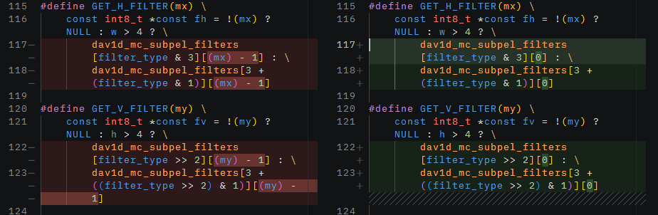

Рис. 24 – дельта файла mc\_tmpl.c

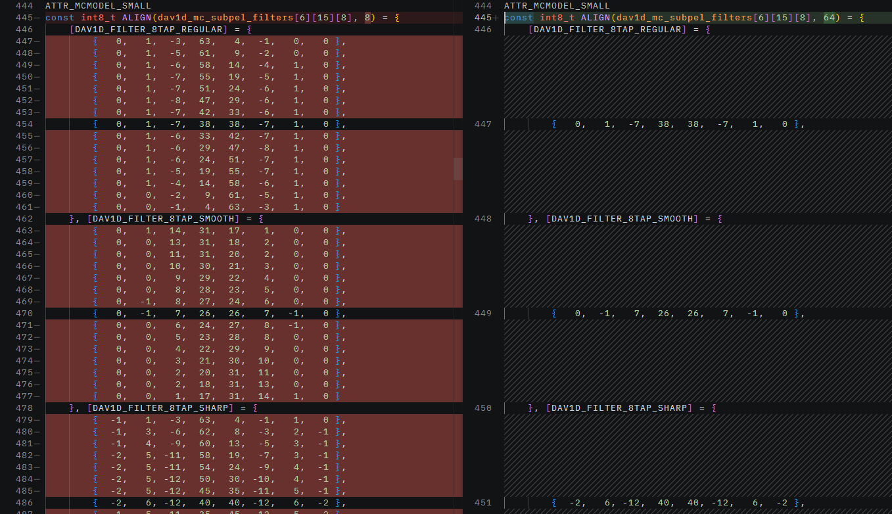

Рис. 25 – дельта файла tables.c

* + 1. Сокращение количества фильтров до 4

В отличие от метода 1, в данном методе не получится просто опустить 2 и 7 фильтры ввиду того, что от этого потеряется баланс суммы коэффициентов, равный 128, ввиду чего будет теряться качество не только в областях интерполяции, но и на всем изображении в целом. Некоторые области будут засветляться или затемняться, интерполируемые от них области также будут менять Luma-компонент, ввиду чего ошибки будут копиться экспоненциально. В связи с этим необходимо переписать значения коэффициентов фильтров, сохраняя сумму 128. Учитывая, что в методе 2 количество вариантов интерполяции было сокращено до 6, объем работы снижен радикально. В DAV1D сумма коэффициентов равна 64, но это не меняет сути, так как в дальнейшем к коэффициентам при интерполяции применяется битовый сдвиг влево, то есть умножение на 2.

Данная оптимизация сокращает время декодирования на 33.1%, 365с со средним значением 373с.

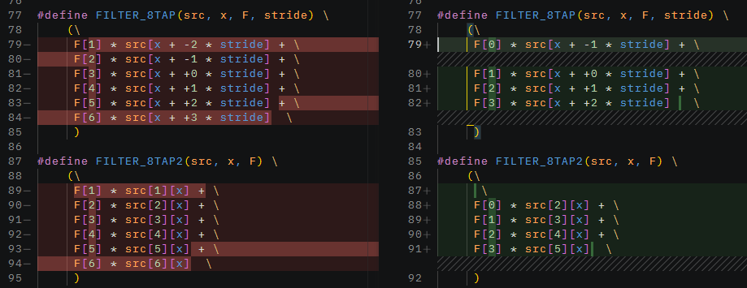

Рис. 26 – дельта файла mc\_tmpl.c

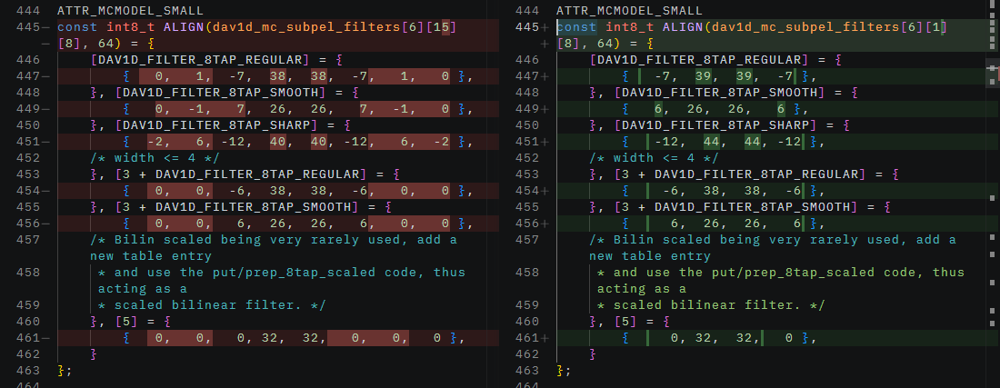

Рис. 27 – дельта файла tables.c

* + 1. Сокращение дробного остатка

При вычислении интерполированного значения используется следующая формула:

(A\*X[0]+B\*X[1]…+(1<<7)>>1)>>7, (8)

Где A..H – коэффициенты интерполяции,

X – массив интерполируемых пикселей,

В данной формуле битовый сдвиг на 7 отвечает за быстрое деление на 128 (отсюда и вытекает требование к сумме коэффициентов), а часть с (1<<7)>>1 является выражением для увеличения точности, сохраняя нечетные биты. Данная оптимизация вырезает это выражение, достигая прироста скорости в 36% при времени декодирования в 349с и среднем времени 353.9с.

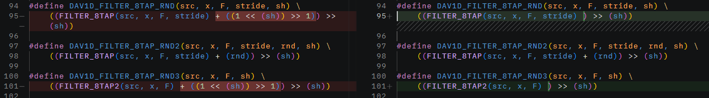

Рис. 28 – дельта файла mc\_tmpl.c

### Оптимизация обратных трансформаций

Как было описано в главе 2, данная оптимизация затрагивает обратные трансформации частот, убирая половину частот в каждой из DCT трансформаций. Экспериментальным путем было выявлено, что избавление от 75% частот вместо 50% приводит к сильным артефактам видео, искажающим его качество.

Данная оптимизация повышает прирост скорости до 38.1% при времени декодирования 337с и среднем времени декодирования 355с.

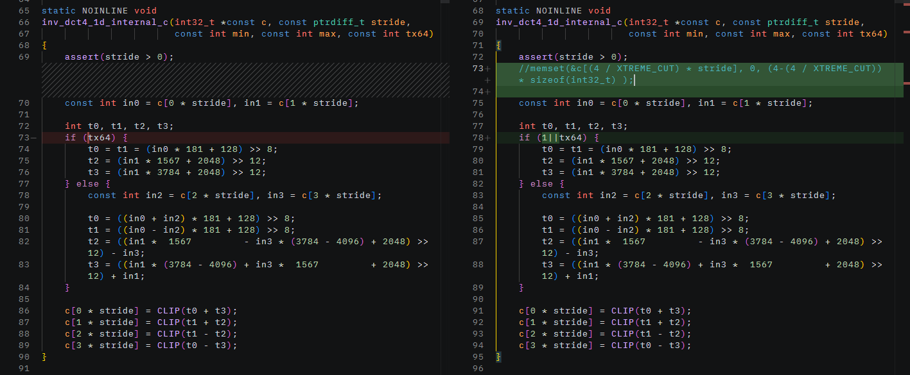

Рис. 29 – дельта файла itx\_1d.c

### Оптимизация реконструкции изображения

В ходе разработки также был вырезан фильтр Винера, используемый для реконструкции кадра. Прирост производительности составил 38.5%, время декодирования – 335.9с при среднем времени в 339с.

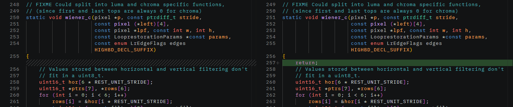

Рис. 30 – дельта файла looprestoration\_tmpl.c

### Выводы

На рисунках 31 и 32 ниже представлены время декодирования видео и прирост производительности в зависимости от оптимизаций. Оптимизации применяются последовательно, поэтому эффект от них – кумулятивный. Суммарный эффект в 38.5% ускорения декодирования отвечает поставленным нефункциональным требованиям.

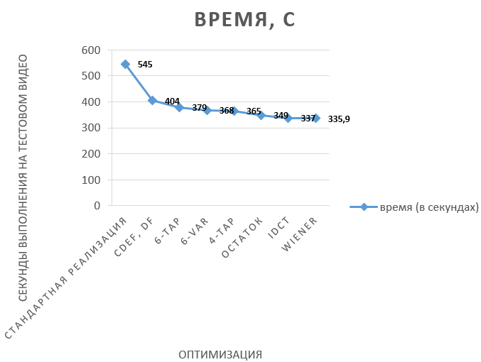

Рис. 31 – зависимость времени декодирования от оптимизаций

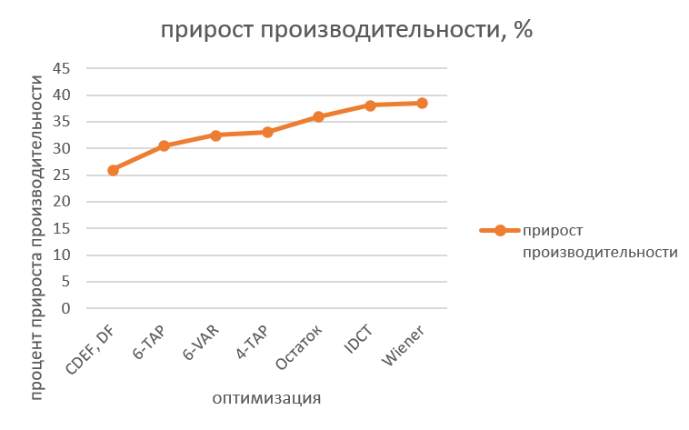

Рис. 32 – зависимость прироста скорости от оптимизаций

* 1. Финальная система

В данном разделе будут описываться 2 системы: наивная, неоптимизированная система и финальная система со всеми оптимизациями.

### Реализация наивной системы

Для данной системы был выбран упрощённый стек из стандартного DAV1D, Fastapi и PostgreSQL. Данная система не масштабируется и медленно обрабатывает одиночные изображения.

Система состоит из трех контейнеров: фронтенд, бэкенд, совмещающий авторизацию и декодирование, а также контейнер базы данных. Бэкенд использует стандартный декодер DAV1D.

1. Реализация Backend

В backend апи главной функцией является upload. Данная функция с помощью FFMPEG отделяет obu-файл (представляющий собой видеопоток av1 кодека) от всего файла, декодирует с помощью стандартного av1 первый кадр, затем с помощью него декодирует остальной поток и возвращает первый кадр. Данная функция представлена на рис. 33.

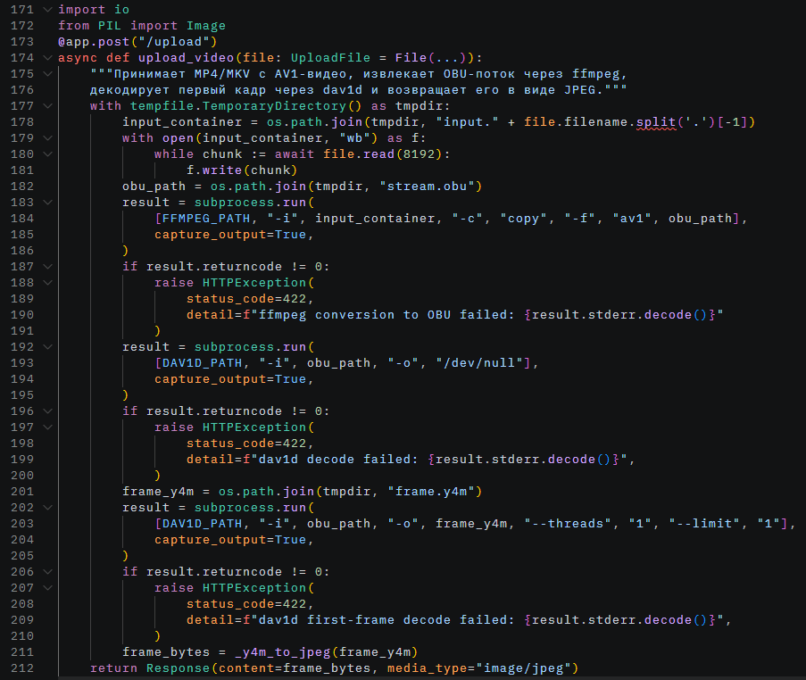

Рис. 33 – naïve upload

Функция также полагается на авторизацию, которая происходит на каждом запросе как обращение к реляционной базе данных ввиду «наивности» реализации. Сервис авторизации использует паттерн access/refresh, для пользователя создаётся короткий access token и долго живущий refresh token. Хэширование происходит по алгоритму SHA256 ввиду того, что Comexp нацелена на западный рынок, ввиду чего не имеет смысла использовать российские алгоритмы шифрования.

Frontend реализован как простое React приложение с двумя экранами.

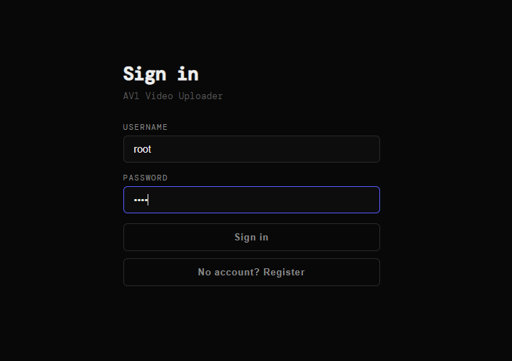

Рис. 34 – экран входа

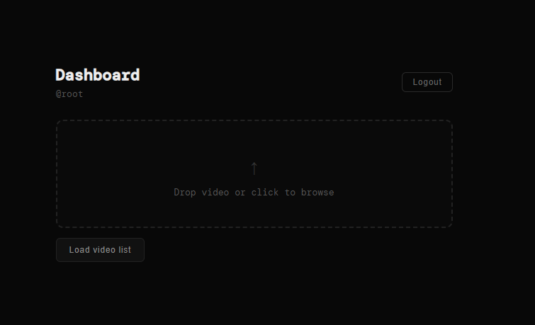

Рис. 35 – экран загрузки

### Реализация оптимизированной системы

Оптимизированная система в целом похожа на наивную реализацию, но имеет больше деталей и оптимизаций.

1. Backend

Самая очевидная оптимизация – использование оптимизированного DAV1D в качестве видеодекодера.

Backend состоит из 6 контейнеров, ниже – пояснения по каждому из них.

* Common-api – API авторизации, необходимое для бизнес-функций.
* Gateway – балансировщик и прокси, проксирует все запросы кроме связанных с upload на common-api, а запросы связанные с upload – на наименее занятую реплику в соответствии с алгоритмом, описанным в разделе 2.2.2. Аккумулирует состояния Decoder-api.
* Decoder-api – API декодирования, использующее оптимизированную версию DAV1D для декодирования видео. Отправляет свой статус на Gateway.
* Nats – контейнер с очередью NATS Jetstream.
* Redis – контейнер с Redis, хранящий горячие данные.
* Db – контейнер с Postgresql, хранящий реляционные данные.

Рассмотрим подробнее каждый первые три.

* 1. Common-api

Данный контейнер во многом похож на вышеописанный контейнер common-api наивной реализации.

Данный контейнер реализует все необходимые эндпоинты, описанные во второй главе.

Эндпоинт /user, необходимый для авторизации пользователя, устроен по принципу процессорного кеша, где L1 выступает Redis, а L3 – PostgreSQL. При получении запроса на получение данных сначала проверяется access token в Redis, а в случае ошибки происходит «холодный промах», при котором проверяется значение в PostgreSQL и в случае успеха сохраняется в Redis.

Access и refresh токены хранятся в реляционной базе данных.

* 1. Gateway

Как уже было описано во второй главе, проблемой становится уведомление пользователя о конце декодирования. Для решения этой проблемы был применен описанный подход: Gateway открывает вебсокет-соединение по адресу /ws/client\_notification, к которому подключаются клиенты передавая свой access token. Далее клиент добавляется в список рассылки, где ключом служит id пользователя, Gateway входит в блокирующее чтение jetstream очереди notifications и при появлении сообщения, адресованного пользователю, отправляет его. В случае если вебсокет закрыт на стороне клиента данный клиент удаляется из списка рассылки. На рисунке 36 представлена функция, отвечающая за рассылку.

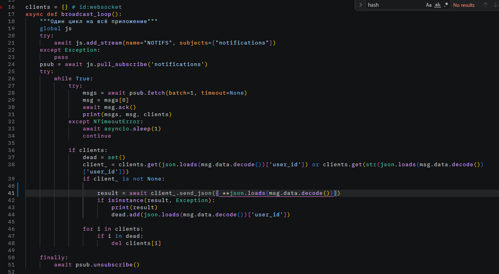

Рис. 36 – функция рассылки сообщений

Второй проблемой является масштабирование нагрузки, для которой был спроектирован алгоритм балансировки. Реплики decoder-api сортируются в первую очередь по загруженности процессора, а во вторую – по оперативной памяти. Разумеется, редко два процессора загружены на идентичное количество работы, так что память будет учитываться редко. Тем не менее, в алгоритм маршрутизации также заложен критерий выбора первого сервера с достаточным количеством оперативной памяти для данного видео. Это необходимо для того, чтобы максимально быстро декодировать видео прямо из памяти, вместе с тем предотвращая заполнение памяти реплики более чем на 90%. В случае, если памяти нет ни на одном сервере, прокси ищет сервер с необходимым количеством дисковой памяти. В случае, если нет и его, возвращается сообщение о том, что свободных реплик нет.

Также Gateway получает информацию от серверов-реплик через вебсокет по адресу /ws/replica с информацией о загрузке ЦПУ за последнюю минуту, свободной оперативной памяти и свободной дисковой памяти.

Чтобы уменьшить сетевые накладные расходы было принято решение отказаться от прямого проксирования к Decoder-api, потому что в таком случае появились бы издержки на передачу данных к одному дополнительному серверу. Вместо этого при GET запросе к апи маршрутизации с access токеном Gateway формирует одноразовый токен, в котором закодирован user и выдаёт ссылку на конкретную реплику декодера с встроенным в неё вышеупомянутым токеном.

* 1. Decoder-api

Decoder-api, будучи API для декодирования, имеет основную функцию upload, принимающую на вход OBU-файл, представляющий собой видеопоток кодека AV1, сохраняющий в оперативную память для уменьшения задержек чтения данных, а после этого декодирующий с помощью оптимизированного видеодекодера DAV1D. После декодирования посылается сообщение в Jetstream очередь с полезной нагрузкой и адресом получателя.

1. Frontend

Frontend во многом напоминает наивную реализацию, однако для сокращения сетевых издержек был разработан алгоритм вырезания из видео аудио. Для этого был скомпилирован FFMPEG в целевую платформу WASM с помощью Emscripten версии 4.0.12, затем интегрирован в React приложение.

* 1. Тестирование

В главе 2 были определены следующие метрики: общая задержка от начала отправки видео на сервер до полного декодирования видео в секундах; минимальное время декодирования видео без учета времени передачи видео по результатам пяти тестовых запусков; покадровая метрика потери качества видео, вычисляемая как разница Luma значений каждого пикселя кадра видео; покадровая метрика PSNR; время ответа при нагрузочном тестировании системы. Для каждого из критериев будет дано подробное объяснение релевантности критерия, протокол тестирования и его результат.

Для тестирования обе системы были развернуты на 1-2 серверах Timeweb Cloud с минимальной конфигурацией: 15Гб дискового пространства, 1Гб оперативной памяти, 1 ядро процессора.

### Общая задержка от начала отправки видео на сервер до полного декодирования

Данный критерий проверяет систему с позиции пользователя: насколько для него изменилось взаимодействие с системой через frontend.

Для данной метрики был написан скрипт, находящийся в репозитории проекта по пути benchmarks\throughput\bench.py. Данный скрипт последовательно загружает OBU-видео в оптимизированную систему и MKV-видео в наивную. Загрузка WASM модуля не эмулируется, так как в оптимизированной системе после первой загрузки он кешируется.

В качестве результата выбирается минимальное время декодирования, так как, по словам профессора MIT Чарльза Лейзерсона, минимальное время выполнения показывает время выполнения с минимальной зашумлённостью [26].

По результатам тестирования минимальное время для оптимизированной системы: 165.9 секунд, для наивной: 283.4 секунд. Бенчмарки для обеих систем выполнялись одновременно и параллельно, чтобы исключить задержки, связанные с флуктуацией скорости сети.

### Минимальное время декодирования видео без учета времени передачи

Данная метрика уже была описана в разделе 3.1, для её замера был разработан скрипт, находящийся в репозитории проекта по пути benchmarks/decoder/dav1d.sh. В ходе профилирования было выявлено, что флуктуации скорости декодирования – незначительны ввиду того, что декодируется получасовое видео. В связи с этим, а также для сокращения времени всего процесса и, соответственно, увеличения скорости разработки, было принято решение измерять производительность по трём итерациям.

### Покадровая метрика потери качества видео

Данная метрика не является стандартом индустрии и необходима скорее для внутренней относительной оценки декодера в компании Comexp. Для её оценки был реализован скрипт, находящийся по пути benchmarks\quality\framewise\_luma.py.

Скрипт вычисляет покадровое отклонение каждого пикселя декодированного видео с помощью оптимизированного декодера и видео декодированного с помощью оригинального декодера, затем вычисляет среднее по кадру и среднее по видео. Результаты бенчмарка представлены в файле-отчёте по пути benchmarks\quality\framewise1000.md. Средняя мера отклонения на тестовом видео при вычислении по тысяче фреймов (примерно 40 секунд) – 6.28 с максимумом 9.62. Данная метрика может принимать значение от 0 до 255, получившийся результат был признан Comexp как приемлемый. На рис. 37 представлен график среднего отклонения по фрейму (сверху) и кумулятивный график отклонения (снизу). Как можно увидеть, на верхнем графике имеются резкие спады – предположительно это связано с тем, что при декодировании Golden frame сбрасывается кеш предсказания и накопленные ошибки вместе с ним.

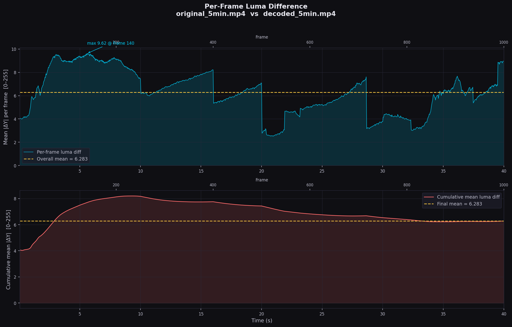

Рис. 37 – график покадрового отклонения luma

### Покадровая метрика PSNR

Следующая метрика – Peak Signal-to-Noise Ratio. В отличие от framewise luma, данная метрика широко используется в видеоиндустрии для оценки деградации качества видео по сравнению с оригиналом. Для её вычисления был разработан скрипт, находящийся по пути benchmarks\quality\psnr.py, отчёт о выполнении представлен в benchmarks\quality\psnr1000frames.md. По результатам выполнения бенчмарка на 1000 фреймов был получен результат 26.2 дБ с минимумом 21.02дБ и максимумом 35.38дБ. Это низкое значение, но оно удовлетворяет требованиям задачи.

### Нагрузочное тестирование

Для нагрузочного тестирования был разработан скрипт, представленный по пути benchmarks\throughput\bench.py. Данный скрипт параллельно отправляет 50 видео по 38мб продолжительностью 60 секунд с задержкой 0.5с на видео. В результате тестирования оптимизированной и наивной систем были получены следующие результаты:

Таблица 6 – нагрузочное тестирование

|  |  |  |  |  |
| --- | --- | --- | --- | --- |
| система | Количество обработанных видео | Суммарное время выполнения бенчмарка, в секундах | Суммарный размер обработанных видео, Мб | Среднее значение скорости обработки видео, Мб/с |
| оптимизированная | 17 | 150.61 | 646 | 4.28 |
| наивная | 50 | 957.84 | 1900 | 1.98 |

Как можно увидеть, оптимизированная система имеет пропускную способность более чем в 2 раза большую, нежели наивная, будучи развернутой на двух серверах. Следует отметить, что 17 обработанных видео – не ошибка, скрипт тестирования реализован так, что при получении сообщения о недостатке свободных реплик он не пытается повторить запрос.

* 1. Исходный код

Исходный код оптимизированного видеодекодера доступен по адресу https://github.com/ressiwage/DAV2D. Исходный код WASM-версии FFMPEG доступен по адресу https://github.com/ressiwage/FFFMPEG. Исходный код всей системы доступен по адресу https://github.com/ressiwage/UFAV1VDS. Протокол бенчмарков видеодекодеров доступен по адресу https://github.com/ressiwage/AV1-bench.

# Заключение

В данной работе имеется ряд нюансов, как, например, отсутствие полноценного тестирования фронтенда и частей, не относящихся к декодированию. Тем не менее, были полностью решены все поставленные задачи, а результаты удовлетворяют метрикам. При достаточном количестве серверов система может обработать любую нагрузку, а её масштабирование происходит линейно. Видеодекодер DAV1D оптимизирован на 38.5%, система целиком – более чем в 2 раза.

В результате анализа был проведен разбор необходимых частей стандарта AV1 для выявления узких мест, необходимых для работы.

В результате проектирования была разработана масштабируемая архитектура двух систем декодирования.

В результате реализации и тестирования была разработана система и были получены необходимые метрики.

# Глоссарий

Motion Vectors (MV) – метод сжатия видео путем извлечения из видео векторов движения.

Constrained directional enhanced filter (CDEF) – метод постобработки видео для устранения артефактов.

Deblocking filter (DF) – метод постобработки видео для уменьшения блочности.

Оверхед – накладные расходы какой-либо технологии.

Видеокодек (кодек) – стандартизированный метод кодирования и реализованный видео.

Видеодекодер (декодер) – стандартизированный метод декодирования видео, реализованный в виде программного обеспечения.

TAPe – запатентованная система компании «ООО КОМЭКСП», предназначенная для индексации видео.

AOMedia Video 1 (AV1) – открытый стандарт видеокодека, разработанный консорциумом AOMedia Alliance for Open Media.

Errata (AV1-v1.0.0errata) – название стандарта, определяющего поведение видеокодека AV1.

Frame – кадр в декодируемом видео, представляющий собой последовательность пикселей. Не обязательно присутствует в конечном видео после декодирования.

Макроблок – сущность, объединяющая квадратную область из нескольких пикселей. Изначально термин из стандарта ITU-T H.264, но также будет использоваться для обозначения суперблоков из стандарта Errata.

Slice – сущность, объединяющая макроблоки.

# Библиографический список

1. Alliance for Open Media. AV1 Bitstream & Decoding Process Specification / Version 1.0.0 with Errata 1 [Электронный ресурс]: технический стандарт / консорциум Alliance for Open Media. – 2021. – URL: https://aomediacodec.github.io/av1-spec/av1-spec.pdf (дата обращения: 19.12.2025).
2. Международный союз электросвязи. Сектор стандартизации (ITU-T). \*Рекомендация ITU-T H.264 (V15). Усовершенствованное кодирование изображений для общих аудиовизуальных услуг = Advanced video coding for generic audiovisual services\* [Электронный ресурс]. — изд. от 13.08.2024. — (Серия H: Аудиовизуальные и мультимедийные системы; инфраструктура аудиовизуальных услуг; кодирование движущегося видео). — URL: https://www.itu.int/rec/T-REC-H.264 (дата обращения: 19.12.2025).
3. Chen Y. An Overview of Core Coding Tools in the AV1 Video Codec / Yue Chen, D. Murherjee, J. Han // IEEE 2018 Picture Coding Symposium (PCS). — P. 41-45 – 2018. — DOI: 10.1109/PCS.2018.8456249.
4. Petreski D. Next Generation Video Compression Standards – Performance Overview / D. Petreski, T. Kartalov // IEEE International Conference on Systems, Signals and Image Processing (IWSSIP) — 2023. — P. 1–5. — DOI: 10.1109/IWSSIP58668.2023.10180261.
5. Kolodziejski W. Speeding Up the AV1 Global Warped Motion Compensation / W. Kolodziejski, R. Domanski, L. Agostini // 2024 IEEE 15th Latin America Symposium on Circuits and Systems (LASCAS). — 2024. — P. 1-5. — DOI: 10.1109/LASCAS60203.2024.10506160.
6. Yi Y. High-Speed CAVLC Encoder for 1080p 60-Hz H.264 Codec / Y. Yi, B. C. Song // IEEE Signal Processing Letters — vol. 15 — 2008. — P. 891–894. — DOI: 10.1109/LSP.2008.2001982.
7. NATS JetStream vs RabbitMQ vs Apache Kafka on VPS in 2025: Throughput/Latency Benchmarks, Exactly‑Once vs At‑Least‑Once, Durability/Replication, TLS/mTLS, and the Best Message Broker for Your Stack / блог компании Onidel [Электронный ресурс]. 8.11.2025. URL: <https://onidel.com/blog/nats-jetstream-rabbitmq-kafka-2025-benchmarks> (дата обращения: 13.02.2026).
8. Angular vs. React vs. Vue.js in 2025 / блог компании DLT Software [Электронный ресурс]. 20.11.2025. URL: https://medium.com/@dltsoft/angular-vs-react-vs-vue-js-in-2025-f24b56ff0064 (дата обращения: 13.02.2026).
9. H.264 is Magic / Sid Bala [Электронный ресурс]. 2.11.2016. URL: https://sidbala.com/h-264-is-magic/ (дата обращения: 13.02.2026).
10. Lin Y., Efficient AV1 Video Coding Using a Multi-layer Framework / Wei‑Ting Lin, Zoe Liu, Debargha Mukherjee // IEEE 2018 Data Compression Conference. — P. 368-369 – 2018. — DOI: 10.1109/DCC.2018.00045.
11. SVT-AV1 documentation: ALTREF and Overlay Pictures [Электронный ресурс]. URL: https://gitlab.com/AOMediaCodec/SVT-AV1/-/blob/master/Docs/Appendix-Alt-Refs.md (дата обращения: 13.02.2026).
12. Salonen N. A Comparative Study of Kafka and NATS : [дипломная работа] / N. Salonen. — Turku : University of Turku, 2025. — 62 c. — URL: https://www.utupub.fi/bitstream/handle/10024/182402/Salonen\_Nino\_opinnayte.pdf (дата обращения: 14.03.2026).
13. Comparing NATS, NATS JetStream, and Kafka Performance for Varying Payload Sizes / Nathan B. Crocker [Электронный ресурс]. 24.09.2024. URL: https://medium.com/@nathanbcrocker/comparing-nats-nats-jetstream-and-kafka-performance-for-varying-payload-sizes-3538c94ac56c (дата обращения: 14.03.2026).
14. Comparison of NATS, RabbitMQ, NSQ, and Kafka / блог компании Gcore [Электронный ресурс]. 20.06.2024. URL: https://gcore.com/learning/nats-rabbitmq-nsq-kafka-comparison (дата обращения: 14.03.2026).
15. Python Flask vs FastAPI vs Django: Framework Comparison 2026 / блог [Электронный ресурс]. 07.02.2026. URL: https://dasroot.net/posts/2026/02/python-flask-fastapi-django-framework-comparison-2026/ (дата обращения: 14.03.2026).
16. Using H.264 video compression in IP video surveillance systems / блог [Электронный ресурс]. 03.04.2009. URL: https://www.networkwebcams.co.uk/blog/h264-video-compression-in-ip-video-surveillance-systems/ (дата обращения: 23.03.2026).
17. Международный союз электросвязи. Сектор стандартизации (ITU-T). \*Рекомендация ITU-T H.264 (V15). Усовершенствованное кодирование изображений для общих аудиовизуальных услуг = Advanced video coding for generic audiovisual services\* [Электронный ресурс]. — изд. от 13.08.2024. — (Серия H: Аудиовизуальные и мультимедийные системы; инфраструктура аудиовизуальных услуг; кодирование движущегося видео). — p. 126. — URL: https://www.itu.int/rec/T-REC-H.264 (дата обращения: 19.12.2025).
18. Международный союз электросвязи. Сектор стандартизации (ITU-T). \*Рекомендация ITU-T H.264 (V15). Усовершенствованное кодирование изображений для общих аудиовизуальных услуг = Advanced video coding for generic audiovisual services\* [Электронный ресурс]. — изд. от 13.08.2024. — (Серия H: Аудиовизуальные и мультимедийные системы; инфраструктура аудиовизуальных услуг; кодирование движущегося видео). — p. 101. — URL: https://www.itu.int/rec/T-REC-H.264 (дата обращения: 19.12.2025).
19. Prediction of Transformed (DCT) Video Coding Residual for Video Compression / статья [Электронный ресурс]. 04.2014. — p. 6 — URL: https://www.researchgate.net/publication/261700797\_Prediction\_of\_Transformed\_DCT\_Video\_Coding\_Residual\_for\_Video\_Compression (дата обращения: 23.03.2026).
20. Ren J. Algorithmic Optimization for H.264 Deblocking Filter on Portable Devices / J. Ren, N. Kehtarnavaz // 2007 IEEE International Symposium on Consumer Electronics. — p. 1-6 – 2007. — DOI: 10.1109/ISCE.2007.4382168
21. Han J. A Technical Overview of AV1 / J. Han, B. Li, D. Mukhergee // Proceedings of the IEEE. — vol. 109, no. 9, p. 1435-1462. — DOI: 10.1109/JPROC.2021.3058584
22. Yi Y. High-Speed CAVLC Encoder for 1080p 60-Hz H.264 Codec / Y. Yi, B. Song // IEEE Signal Processing Letters. — vol. 15, p. 891-894, 2008. — DOI: 10.1109/LSP.2008.2001982
23. Moroz L. Efficient Floating-Point Division for Digital Signal Processing Application [Tips & Tricks] / L. Moroz, V. Samotyy // IEEE Signal Processing Magazine. — vol. 36, no. 1 — P. 159-163 – 2019. — DOI: 10.1109/MSP.2018.2875977
24. Time scale of system latencies / блог [Электронный ресурс]. 05.2014. — URL: https://perfsolutions.blogspot.com/2014/05/time-scale-of-system-latencies.html (дата обращения: 23.03.2026).
25. AV1 benchmark / репозиторий [Электронный ресурс]. 23.03.2026. — URL: https://github.com/ressiwage/AV1-bench (дата обращения: 23.03.2026).
26. 10. Measurement and Timing / курс MIT 6.172, видеолекции [Электронный ресурс]. 23.09.2019. URL: https://www.youtube.com/watch?v=LvX3g45ynu8&list=PLUl4u3cNGP63VIBQVWguXxZZi0566y7Wf&index=10 (дата обращения: 17.05.2026).
27. 4. Measurement and Timing / курс MIT 6.172, видеолекции [Электронный ресурс]. 23.09.2019. URL: https://youtu.be/L1ung0wil9Y?si=Y7x0qU8wag98p\_iA&t=4032 (дата обращения: 17.05.2026).
28. ДИАГРАММА прецедентов

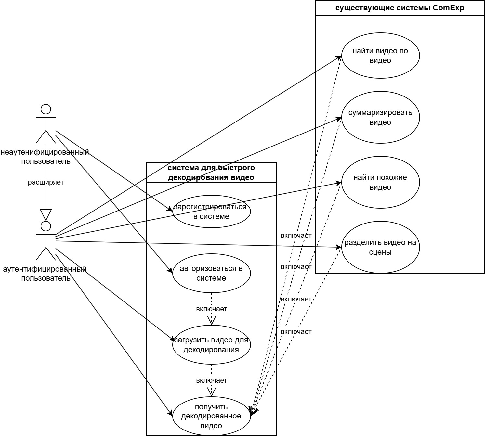

1. ДИАГРАММА последовательностей

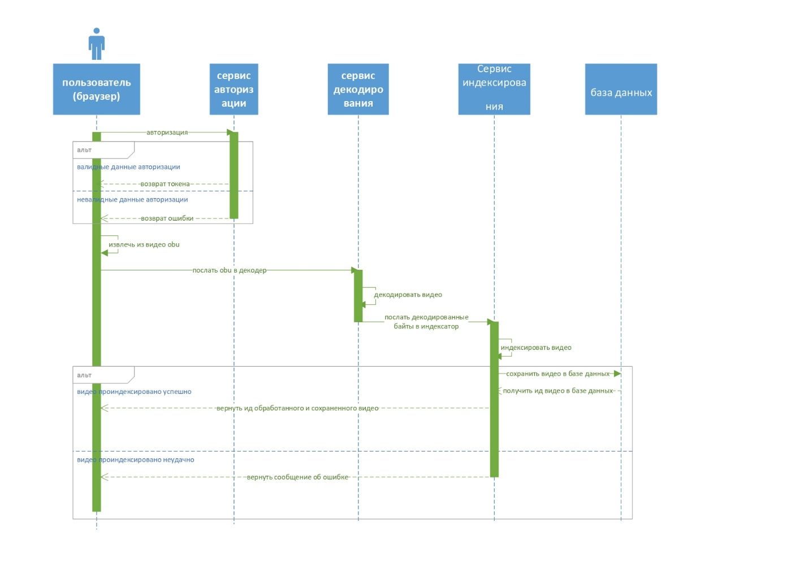

1. упрощённая структура видеодекодера

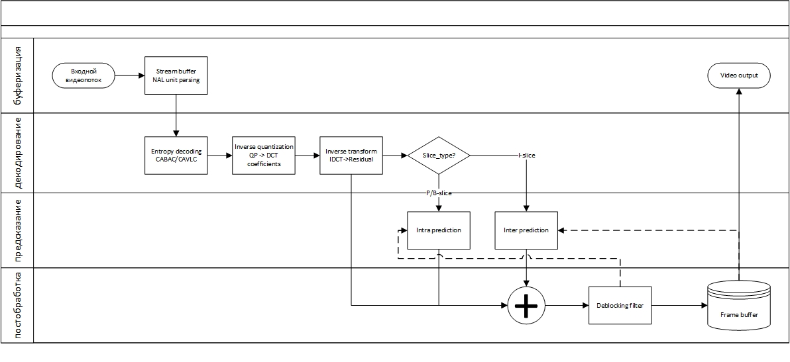

1. существующий бизнес-процесс

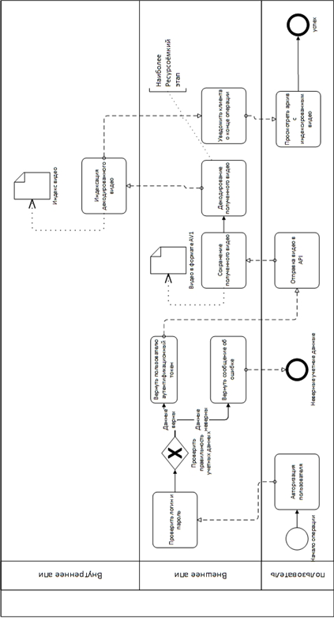

1. Техническое задание

Техническое задания разработано на основе выполненного анализа по ГОСТ 19.201-78–2010 и загружено в SmartLMS отдельно как документ «РИС-22-2-Берсенёв\_ИИ\_ТЗ.docx».